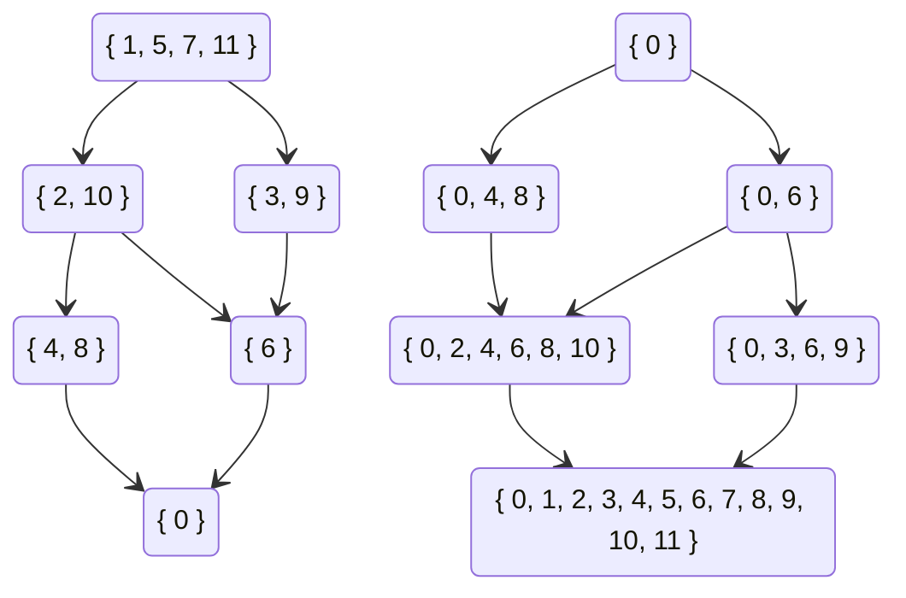

## 整除与因子

对于正整数$a,b$，若存在正整数$k$使得$ak=b$，则称$$整除$b$，记作$a|b$。

对于正整数$a,b$，若$a|b$，则称$a$是$b$的因子。

性质1：若$a|b$，则$\frac ba |b$。证明显然。

性质2：对于$n$的任何一个因子$d$，要么$d \leq \sqrt n$，要么$n / d \leq \sqrt n$（当$\sqrt n$是整数时两者均成立）。

通过性质2可以在$O(\sqrt n)$内找到$n$的所有因子。即枚举$\sqrt n$内的所有正整数$d$，检查是否有$d|n$，若是则将$d$和$\frac nd$加入因子集（注意判断是否有$d = n/d$）。

性质3（传递性）：若$a | b, b | c$，则$a | c$。证明显然。

定义（质数）：若正整数$n \geq 2$只有$1$和$n$两个因子，则称$n$为质数（或素数），否则称为合数。

定义（质因子）：若正整数$n$能被质数$p$整除，则称$p$为$n$的质因子。

定理（唯一分解定理）：每个大于$1$的正整数$n$都能唯一的写成一串不递减的素数的乘积。

证明略。

定理（质数定理）：$n$以内的素数数量是$O(n / \ln n)$级别的。证明略。

算法（埃式筛）：

找到$n$以内的所有质数可以在$O(n \log \log n)$的时间复杂度内解决。证明略。

遍历从$2$到$n$的所有正整数，对于每个质数将其所有倍数筛去，这样就得到了原始的埃式筛。

因为所有质数里面只有$2$不是奇数，所以只需要筛掉大于等于$3$的奇合数。

因为大于$2$的偶数不可能是质数，所以对于质数$p$只需要筛掉其奇数倍的数，即$3p,5p,7p,\cdots$。

当找到质数$p$时，所有最小质因子小于$p$的合数均已被筛去，因此接下来第一个未被筛去的$p$的倍数应是$p^2$。

```cpp
vector<int> eratosthenes_sieve(int n) {
    vector<int> primes;
    vector<char> is_prime(n + 1, true);
   	is_prime[1] = 0;
    for (int i = 3; i <= n; i += 2) {
        if (!is_prime[i]) continue;
        primes.push_back(i);
        for (int j = i * i; j <= n; j += 2 * i)
            is_prime[j] = false;
    }
    return primes;
}
```

算法（朴素质因数分解）：

对于合数$n$来说，其大于$\sqrt n$的质因子至多只有一个，所以只需要检查小于等于$\sqrt n$的所有素数是否能够整除$n$。

$\sqrt n$以内的素数可以预处理，因此运行$T$次$O(n)$级别的质因数分解的时间复杂度是$O\left(\sqrt {n} \log \log n+T \sqrt {n / \log n}\right)$。

```cpp
vector<int> prime_factorization(int n) {
    vector<int> factors;
    vector<int> primes = eratosthenes_sieve((int)sqrt(n));
    for (int p : primes) {
        if (p * p > n) break;
        while (n % p == 0) {
            factors.push_back(p);
            n /= p;
        }
    }
    if (n != 1)
        factors.push_back(n);
    return factors;
}
```

## 带余除法与模运算

定义（带余除法）：给定非负整数$a$，正整数$b$，存在非负整数$q,r$满足$a=bq+r(0 \leq r <b)$。其中$q$为商，$r$为余数。

在C++中，`q=a/b`而`r=a%b`。

定义（同余）：对于模数$m$，可以定义一个$\mathbb{Z}$上的等价关系$\equiv_m$，$a \equiv_m b$当且仅当存在整数$k$使得$a+km=b$。一般记作$a \equiv b \bmod m$。

等价关系$\equiv_m$将$\mathbb{Z}$划分成了$m$个剩余类$\bar 0,\bar 1,\cdots ,\overline{m-1}$。

等价类之间可以定义和整数一样的加法和乘法，这里称为模意义下的加法和乘法。

模意义下的加法和乘法满足交换律、结合律、分配律。

命题：若$a \equiv b \bmod m$，则$ka \equiv kb \bmod km$

证明：因为$a=dm+b$，所以$ka=dkm+kb$。

## 欧几里得算法

命题：对于正整数$a,b$，$\gcd (a,b)=\gcd(b, a \bmod b)$。

证明：设$\gcd(a,b)=d_1,\gcd(b, a \bmod b)=d_2$。

由定义得存在$k_1,k_2 \in \mathbb{Z}$使得$a=k_1d_1,b=k_2d_1$，则$a \bmod b=a-\lfloor a/b \rfloor b=(k_1-\lfloor a/b \rfloor k_2)d_1$，因此$d_1|a \bmod b$。所以$d_1 | d_2$。

由定义得存在$k_1,k_2 \in \mathbb{Z}$使得$b=k_1d_2,a \bmod b=k_2d_2$，则$a=a \bmod b+\lfloor a/b \rfloor b=(k_2+k_1\lfloor a/b \rfloor )d_2$，因此$d_2 | a$。所以$d_2 | d_1$。

于是$d_1=d_2$。

算法（欧几里得）：

因为每一轮迭代中$a$与$b$的和至少减少$1$，所以算法一定能够结束。

```cpp
int euclid(int a, int b) {
    if (b != 0) return euclid(b, a % b);
    else return a;
}
```

算法（扩展欧几里得）：

对欧几里得算法进行一些修改可以求得一组系数$u,v$使得$au+bv=\gcd (a,b)$。

设欧几里得算法运行时每一轮迭代参数分别是$a_1,a_2,\cdots a_n$，其中$a_n=0$，$a_{n-1}=\gcd(a,b)$，且对于$i \geq 1$有$a_{i+2}=a_i \bmod a_{i-1}$。

设$a_i=q_i a_{i+1}+a_{i+2}$，其中$q_i=\lfloor a_i / a_{i+1} \rfloor$且$u_ia_i+v_ia_{i+1}=d$，则
$$
u_ia_i+v_ia_{i+1}=u_i(q_ia_{i+1}+a_{i+2})+v_ia_{i+1}=(u_iq_i+v_i)a_{i+1}+u_ia_{i+2}=u_{i+1}a_{i+1}+v_{i+1}a_{i+2}
$$
因此$u_i=v_{i+1},v_{i}=u_{i+1}-q_{i}u_{i}$。

递归终点为$1 \cdot a_{n-1}+0\cdot a_n=\gcd(a,b)$。

注意到有
$$
v_{i}=-q_{i}v_{i+1}+v_{i+2}
$$

$$
v_{n-1}=0 \leq a_{n-1},v_{n-2}=-q_{n-2}v_{n-1}+v_{n}=v_n=1 \leq a_{n-2}
$$

当$i<n$时有$|v_i|=|-q_iv_{i+1}+v_{i+2}| \leq q_i|v_{i+1}|+|v_{i+2}|\leq q_ia_{i+1}+a_{i+2}=a_i$，因此最终得到的$u_i$和$v_i$的绝对值不会超过$a_1$和$a_2$的绝对值。

```cpp
pair<int, int> ext_euclid(int a, int b) {
    if (b != 0) {
        pair<int, int> res = ext_euclid(b, a % b);
        return { res.second, res.first - (a / b) * res.second };
    }
    else return { 1, 0 };
}
```

## 一次不定方程

定义（二元一次不定方程）：形如$ax+by=c$的方程称为二元一次不定方程，其中$a,b,c$已知。

先考虑$c=0$的情况。

命题：设$x_0$为使得方程$ax_0+by=0$有整数解$y=y_0$的最小正整数，则对于方程$ax+by=0$的任意解$x,y$均存在$k$使得$x=kx_0,y=ky_0$。

证明：若$ax_1+by_1=0$且$x_0\nmid x_1$，将$x_1$除以$x_0$得$x_1=qx_0+r(0< r < x_0)$，则有$a(x_1-qx_0)+b(y_1-qy_0)=0$。令$x_2=x_1-qx_0,y_2=y_1-qy_0$，显然$x_2=r<x_0,y_2$是比$x_0$更小的正整数解，导出矛盾。因此不存在$x_1,y_1$使得$x_0 \nmid x_1$且$ax_1+by_1=0$，得证。

注意到$b|ax_0$，因此$ax_0$是$a$与$b$的最小公倍数。即$ax_0=\text{lcm} (a, b)=\frac{ab}{\gcd(a,b)}$

命题：不妨设$b>0,d = \gcd (a, b)$，则$x_0=\frac bd,y_0=-\frac ad$。

结论：二元一次不定方程$ax+by=0$的解集是$\{(x,y)|k \in \mathbb{Z} ,x=\frac {kb}{d},y=-\frac {ka}{d}\}$。其中$d=\gcd (a,b)$。

注意到若能够找到任意一组$x^*, y^*$使得$a x^*+by^*=c$，则方程$ax+by=c$的解集可以写成$\{(x,y)|k \in \mathbb{Z} ,x=\frac {kb}{d}+x^*,y=-\frac {ka}{d}+y^*\}$。其中$d=\gcd (a,b)$。

上一节中的扩展欧几里得算法可以用来解决寻找$x^*,y^*$的问题。

运行扩欧后得到$(u,v)$使得$au+bv=d$，若$d \nmid c$则方程无解（证明思路同上）。否则有$x^*=\frac {cu}{d},y^*=\frac{cv}{d}$。

总结一下，二元一次不定方程$ax+by=c$的解集是

$$
\{(x,y)|k \in \mathbb{Z}, x=\frac{kb+cu}{d},y=\frac{-ka+cv}{d}\}
$$

其中$u,v,d$为使用扩展欧几里得算法解$au+bv=d$所得。

## 一次同余方程

模意义下的除法问题可以描述为解一次同余方程$ax \equiv b \bmod m$。

定义（一次同余方程）：对于模数$m$，给定$a,b$求$x$使得$ax \equiv b \bmod m$。

由同余的意义可得，一次同余方程的解集与不定方程$ax + my = b$的解集相同，即$x=\frac{km+bu}{d}$，也可写成$$x \equiv \frac {bu}{d} \bmod \frac md$$

在模$m$的意义下为以下同余类：$$\overline{\frac md+\frac {bu}d},\overline{\frac {2m}d+\frac {bu}d}，\cdots$$

一次同余方程在当$b=1,\gcd(a,m)=1$时一定只有一个解$x$，定义$x$为$a$在模$m$意义下的乘法逆（逆元），记为$x=a^{-1}$。

命题：对于质数$p$，求$1$到$n$内所有数的逆元可用以下递推式求解：
$$
a^{-1}\equiv (p \bmod a)^{-1}(p - \lfloor p/a\rfloor)
$$
设$p=qa+r(0 \leq r <a)$，则
$$
\left((p-q)r^{-1}\right)a=(p-q)r^{-1}(p-r)/q\equiv(p-q)(r^{-1}p-1)q^{-1}\bmod p\\
=r^{-1}q^{-1}p^2-(r^{-1}+q^{-1})p+1\equiv1 \bmod p
$$

递推边界条件为`inv[1]=1`。时间复杂度$O(n)$。

## 一次同余方程组

定义（一次同余方程组）：形如

$$
\begin{cases}
x \equiv & b_1 \bmod m_1\\
x \equiv & b_2 \bmod m_2\\
\vdots &\\
x \equiv & b_n \bmod m_n
\end{cases}
$$

的方程组被称为一次同余方程组。

命题：一次同余方程组的解是一次同余式。证明略。

定理（中国剩余定理）：当$m_i$两两互质时，方程组有解

$$
x \equiv \sum_{i=1}^{n} b_iu_iv_i \bmod M
$$

其中
$$
M=\prod_{i=1}^{n}m_i,u_i=\frac{M}{m_i},u_iv_i \equiv 1 \bmod m_i
$$

证明：考虑第$i$项，因为$\gcd(u_i, m_i)=1$，所以$v_i$存在且唯一。因为当$i \neq j$时有$m_j|u_i$，所以$b_iu_iv_i \equiv 0 \bmod m_j$，否则有$b_iu_iv_i \equiv b_i \bmod m_i$。因此第$i$项对第$i$个方程的贡献是$b_i$，对其他方程都是$0$。

从另一个角度来考虑，即将两个一次同余方程合并。

考虑不定方程

$$
b_1+k_1m_1=b_2+k_2m_2
$$

移项

$$
k_1m_1-k_2m_2=b_2-b_1
$$

对$m_1u+(-m_2)v=d$运行扩展欧几里得算法解得$u,v,d$

则解为

$$
k_1=\frac{(b_2-b_1)u-km_2}{d},k_2=\frac{(b_2-b_1)v-km_1}{d}
$$

代入原式

$$
b_1+\frac{(b_2-b_1)um_1}{d}-k\frac{m_1m_2}{d}=b_2+\frac{(b_2-b_1)vm_2}{d}-\frac{km_1m_2}{d}
$$

解得

$$
x\equiv b_1+\frac{(b_2-b_1)um_1}{d} \bmod \frac{m_1m_2}{d}
$$

将同余式依次合并至$x \equiv 0 \bmod 1$即可解出模数任意的一次同余方程组。

### 组合数取模

卢卡斯定理：

$$\binom{n}{k} \equiv \binom{\lfloor \frac np\rfloor}{\lfloor \frac kp\rfloor}*\binom{n \mod p}{k \mod p} \mod p $$

```cpp
ll mbinom(ll n, ll k, ll p) {
    static ll f[N];
    for (int i = f[0] = 1; i != p; ++i) f[i] = f[i - 1] * i % p;
    ll ans = 1;
    do {
        if (n % p < k % p) return 0;
        ans = ans * (f[n % p] * inv(f[k % p] * f[(n - k) % p], p) % p) % p;
        n /= p; k /= p;
    } while (n);
    return ans;
}
```

#### 扩展卢卡斯定理

```cpp
ll mfac(ll n, ll p, ll q) {
    if (!n) return 1;
    static map<ll, vector<ll>> m;
    vector<ll>& v = m[p]; if (v.empty()) v.push_back(1);
    for (int i = v.size(); i <= q; ++i)
        v.push_back(v.back() * (i % p ? i : 1) % q);
    return qpm(v[q], n / q, q) * v[n % q] % q * mfac(n / p, p, q) % q;
}

ll mbinom(ll n, ll k, ll p, ll q) {
    ll c = 0;
    for (ll i = n; i; i /= p) c += i / p;
    for (ll i = k; i; i /= p) c -= i / p;
    for (ll i = n - k; i; i /= p) c -= i / p;
    return mfac(n, p, q) * inv(mfac(k, p, q), q) % q
    * inv(mfac(n - k, p, q), q) % q * qpm(p, c, q) % q;
}

ll mbinom(ll n, ll k, ll m) {
    vector<pair<ll, ll>> ps = pfd(m);
    ll b = 0, w = 1;
    for (pair<ll, ll> pp : ps) {
        ll p = pp.first, q = 1;
        while(pp.second--) q *= p;
        crt(b, w, mbinom(n, k, p, q), q);
    }
    return b;
}
```

## $\mathbb{Z}/n\mathbb {Z}$的结构



$\mathbb{Z} /n \mathbb{Z}$是模$n$意义下的$n$个剩余类与模$n$加法、模$n$乘法组成的代数结构，模$n$剩余类环。这个结构完整的刻画了模运算的性质。

对于模意义下的加法，模$n$意义下的$n$个剩余类构成了一个群$\mathbb {Z}_n$。$\mathbb {Z}_n$同构于循环群$C_n$。

对于$n$的每个因子$d$，由$d$倍数剩余类集合$\{\overline{kd}|0 \leq k < n/d\}$构成了$\mathbb {Z}_n$的子群。这个子群同构于$\mathbb {Z}_{n/d}$，即$C_{n/d}$。

子群之间的包含关系是一个典型的偏序关系，由此可以画出哈斯图。如上面的$\mathbb {Z}_{12}$。

关于加法的性质比较简单，接下来将主要分析乘法的性质。

将$\mathbb {Z}_n$中的每个元素视作一张有向图中的点，并对于$x$将所有$u$连向$xu$，可以得到一张有向图。

### $\mathbb {Z}_n$中元素的阶

对于$\mathbb {Z}_n$中所有与$n$互质的元素，其与模$n$意义下的乘法形成了一个群$\mathbb {Z}_n^\times$。

由欧拉函数的定义，这个群的大小为$\varphi(n)$。

定义（元素的阶）：给定有限群$G$，对于$g \in G$，定义$g$的阶为使得$g^x=e$的最小正整数$x$，即
$$
\text{ord}(g)= \min_{x \in \mathbb {N}^+,g^x =e} x
$$
性质：$\mathbb {Z}_n^\times$中每一个元素的阶数都是群大小$\varphi(n)$的因子。由关于子群阶数的拉格朗日定理显然。

给定任意一个与$n$互质的$a$，若要求$a$模$n$的阶，最朴素的做法是依次计算$a$的幂。时间复杂度$O(n)$。

由上面的性质可以得到一个在给定$n$的质因数分解的前提下求元素阶数的对数时间算法。

设$\displaystyle \text{ord}(a)=\prod_{i=1}^kp_i^{\alpha_i},\varphi(n)=\prod_{i=1}^kp_i^{\beta_i}$，目标即计算每个$\alpha_i$。考虑到$\text{ord}(a^{p_i})=\text{ord}(a)/p_i$，因此有
$$
\text{ord}(a^{p_i^k})=\text{ord}(a)/p_i^{\min(k,\alpha_i)}
$$
因为有$\beta_i \geq \alpha_i$，所以
$$
\text{ord}(a^{p_i^{\beta_i}})=\text{ord}(a)/p_i^{\min(\alpha_i,\beta_i)}=\text{ord}(a)/p_i^{\alpha_i}
$$
因此
$$
\text{ord}(a^{\varphi(n)/p_i^{\beta_i}})=p_i^{\alpha_i}
$$
问题转化为求$a^{\varphi(n)/p_i^{\beta_i}}$的阶。因为有$0\leq \alpha_i \leq \beta_i$，所以对于每个$i$遍历所有可能的$\alpha_i$即可。

时间复杂度$O(\displaystyle \log n\sum_{i}\beta_i)=O(\log^2 n)$。

```
struct pf { ll p, e, q; };	//	pow(p,e)=q
vector<pf> prime_factorization(ll n);
ll qpm(ll a, ll b, ll m);	//	returns pow(a, b) bmod m
ll phi(ll n);

//	phn = phi(n), pfs = prime_factorization(phi(n))
ll ord(ll n, ll phn, const vector<pf>& pfs, ll g) {
    ll res = 1;
    for (pf p : pfs)
        for (ll t = qpm(g, phn / p.q, n); t != 1; res *= p.p)
            t = qpm(t, p.p, n);
    return res;
}
```

定理（Euler）：
$$
\forall a,\gcd(a,n) =1 \Rightarrow a^{\varphi(n)}=\left(a^{ord(a)}\right)^{\varphi(n)/ord(a)}=1^{\varphi(n)/ord(a)}=1
$$
因此有
$$
\forall a, \gcd(a,n)=1 \Rightarrow a^b \equiv a ^{b \bmod \varphi(n)} \bmod n
$$
此即欧拉降幂。

这个定理同时提供了求逆元的另一个思路（区别于扩展欧几里得）。即当$\gcd(a,n)=1$时有
$$
a^{-1} \equiv a^{\varphi(n)-1} \bmod n
$$

### 扩展欧拉降幂

那么当$\gcd(a,n) \neq 1$的时候呢？

这里只考虑$b \geq \varphi(n)$的情况。设$\displaystyle a=m\gcd(a,n)=m\prod_{i=1}^kp_i^{\alpha_i},n=\prod_{i=1}^kp_i^{\beta_i}$，其中$\gcd(m,n)=1$。
$$
a^b\equiv m^{b \bmod \varphi(n)}\left(\prod_{i=1}^kp_i^{\alpha_ib}\right) \bmod \prod_{i=1}^kp_i^{\beta_i}
$$

左半部分已经解决，考虑右半部分。对每个$p_i$分别解决。

注意到$p_i^x \bmod wp_i^r$关于$x$一定存在循环节（考虑一个每个点出度均为1的有向图），这里$\gcd(w,p_i)=1$。

存在引理：
$$
p_i^{b} \equiv p_i^{b \bmod \varphi(n)+\varphi(n)} \bmod n
$$
证明：

设$n=w p_i^r$，其中$\gcd(w,p_i)=1$，则有
$$
p_i^{\varphi(n)}\equiv \left(p_i^{\varphi(w)}\right)^{\varphi(n)/\varphi(w)}\equiv1 \bmod w
$$
两边同乘$p_i^r$得
$$
p_i^{\varphi(n)+r}\equiv p_i^r \bmod n
$$

将两边指数同时加上$1,2,\cdots$即可得到

命题：当$b \geq r$时，有
$$
p_i^{b}\equiv p_i^{b+\varphi(n)} \bmod n
$$
这意味着当$b \geq r+\varphi(n)$时，可以将$b$替换为$b-\varphi(n)$。

通过一个对$r$的放缩即可得到更好用的形式（不用专门求$r$且对降幂复杂度没有显著影响）。

命题：设$n=\displaystyle \prod_{i=1}^k p_i^{\beta_i}$，有$\varphi(n) \geq \beta_i$。

证明：

因为$\varphi(p_i^{\beta_i})\geq \beta_i$加上显然的$\varphi(n) \geq \varphi(p_i^{\beta_i})$可以推出$\varphi(n) \geq \beta_i$，所以对仅有一个质因子的$n$证明即可。

因为$\varphi(p_i^{\beta_i})=p_i^{\beta_i-1}(p_i-1)$关于$p_i$单调增，所以$p\geq q$则$\varphi(p^k)\geq \varphi(q^k)$，所以对$p=2$证明即可。

对于$p=2$显然有$2^{k-1}-k\geq 0$，证毕。

由此可得更通用的形式：当$b \geq \varphi(n)$时
$$
p_i^{b} \equiv p_i^{b \bmod \varphi(n)+\varphi(n)}
$$
因为$\alpha_i \geq 1$，所以有
$$
p_i^{\alpha_ib}\equiv p_i^{\alpha_i b \bmod \varphi(n)+\varphi(n)}
$$
所以
$$
a^{b}\equiv m^{b \bmod \varphi(n)}\left(\prod_{i=1}^kp_i^{\alpha_ib \bmod \varphi(n)+\varphi(n)}\right) \bmod n
$$
因为$\gcd(m,n)=1$，所以$m^{\varphi(n)} \equiv 1 \bmod n$，所以

定理（扩展欧拉降幂）：对于任意$a,b,n \geq 1$有
$$
a^b \equiv 
\begin{cases}
a^{b \bmod \varphi(n)} & \gcd(a,n) =1\\
a^{b} & \gcd(a,n) \neq 1 \wedge b < \varphi(n)\\
a^{b \bmod \varphi(n)+\varphi(n)} & \gcd(a,n) \neq 1 \wedge b \geq \varphi(n)
\end{cases}
\mod n 
$$

定理（Bauer）：

(1): 如果$p$是$m$的一个奇素因子，且$p^\alpha$是$p$能整除$m$的最高幂次，则有
$$
\prod_{i,\gcd(m,i)=1}(x-i)\equiv(x^{p-1}-1)^{\varphi(m)/(p-1)} \bmod p^\alpha
$$
(2): 如果$m$是偶数，且$2^\alpha$是$2$能整除$m$的最高幂次，则有
$$
\prod_{i,\gcd(m,i)=1}(x-i)\equiv(x^{2}-1)^{\varphi(m)/2} \bmod 2^\alpha
$$

### $\mathbb{Z} /n \mathbb{Z}$乘法群的结构

$\mathbb{Z} / n \mathbb{Z}$中共有$\varphi(n)$个单元，这些单元组成了一个乘法群。

这个乘法群的结构和$n$的质因数分解有直接关系。

定理（中国剩余定理）：对于任意正整数$n \geq 2$，若$n$的质因数分解为$n=\displaystyle \prod_{i=1}^m p_i^{e_i}$，则有
$$
\mathbb{Z}/n\mathbb {Z}=\bigotimes_{i=1}^{m}\mathbb{Z}/p_i^{e_i}\mathbb{Z}
$$
其中$\bigotimes$是直积。

命题：环的直积的乘法群等于环的乘法群的直积。证明略。

因此只需考察$\mathbb{Z}/p^e\mathbb {Z}$的乘法群的结构。

定理：

若$p=2$，则当$e \geq 2$时 $\mathbb{Z} /p^e\mathbb {Z}$的乘法群为$C_2 \times C_{2^{e-2}}$，否则为平凡群。

若$p>2$，则$\mathbb{Z}/p^e\mathbb {Z}$的乘法群为$C_{p-1}\times C_{p^{e-1}}$。

## 二次剩余

定义：对于$p$的每个剩余类$\bar x$，若存在$\bar r$使得$\bar r^2 \equiv x \bmod p$，则称$\bar r$是模$p$意义下的二次剩余。

算法(Tonelli-Shanks)：

设$p=2^sq+1$。令$r=x^{(q+1)/2},t=x^q$，则有$r^2 \equiv tx \bmod p$。

TS算法通过修改$r$和$t$来将$t$的阶数一步步降为$1$。

最开始时，$t$的阶数一定是$2$的某个幂次。

当$t$的阶数为$1$时，$t=1$，此时的$r$即为所求。

否则找到模$p$意义下的任意一个非二次剩余$y$。

令模$p$乘法群的任意一个原根为$g$。令$h=g^q,z=y^q$，则有$\log_g z=2k+1=\log_hy$ 。

将$y$每平方一次相当于将$\log _hy$的最低位往上移一位。

若$y^2$的最低位与$t$的最低位相同，则将$y^2$乘上$t$可将$\log _ht$的最低位往上移。（即将$2\log _hy$加上$\log_h t$发生进位）

此时将$y$乘上$r$可维护$r^2 \equiv tx \bmod p$。

注：若要检验$\log_h t$的最低位是否大于$2^k$，只需计算$t^{2^{k}}$是否为$1$。

因为$h$生成的是一个大小为$2^s$的循环群，所以依次消除最低位后$\log _ht$最终会变成$0$，即此时$t=1$，算法结束。

复杂度$O(s \log p)=O(\log ^2 p)$。

```cpp
int tonelli_shanks(int x) {
    if (!x) return 0;
    if (qpm(x, (p - 1) / 2) != 1) return -1;
    if (p % 4 == 3) return qpm(x, (p + 1) / 4);
    int z = 2; while (qpm(z, (p - 1) / 2) == 1) ++z;
    const int s = __builtin_ctz(p - 1), q = (p - 1) >> s;
    int r = qpm(x, (q + 1) / 2), t = qpm(x, q);
    z = qpm(z, q);
    for (int i = 1; i < s; ++i) {
        int y = mul(z, z);
        if (qpm(t, 1 << (s - i - 1)) != 1)
            t = mul(t, y), r = mul(r, z);
        z = y;
    }
    return r;
}
```

算法(Cipolla)：

先找到任意一个$z$使得$z^2-x$不是二次剩余。

令$t=z^2-x$，因为在扩域$\mathbb F_p[\sqrt t]$中：
$$
(z+\sqrt t)^{(p+1)}=\sum_{i=0}^{p+1}\binom {p+1}{i}z^i\sqrt t^{p+1-i}\\=\binom {p+1}0z^0\sqrt t^{p+1}+\binom {p+1}1 z^1\sqrt t^p+\binom {p+1}{p} z^p\sqrt t^1+\binom {p+1}{p+1}z^{p+1}\sqrt t^0\\
=\sqrt t^{p+1}+(p+1)z \sqrt t^p+(p+1) z^p\sqrt t^1+z^{p+1}\\
=t^{(p-1)/2+1}+(p+1)zt^{(p-1)/2}\sqrt t+(p+1)z\sqrt t+z^2\\
=(-1)t+(p+1)z(-1)\sqrt t+(p+1)z \sqrt t+z^2=z^2-t=x
$$
所以直接在扩域中做一次快速幂即可。即计算$(z+\sqrt t)^{(p+1)/2}$。

复杂度$O(\log p)$，常数有点大。$p$在`int`范围内时比Tonelli-Shanks快一倍左右。

```cpp
inline pair<int, int> mul(int a1, int a2, int b1, int b2, int t) {
    return { add(mul(a1, b1), mul(t, mul(a2, b2))), add(mul(a1, b2), mul(a2, b1)) };
}
int cipolla(int x) {
    if (!x) return 0;
    if (qpm(x, (p - 1) / 2) != 1) return -1;
    if (p % 4 == 3) return qpm(x, (p + 1) / 4);
    int z = 2, t; while (qpm(t = sub(mul(z, z), x), (p - 1) / 2) == 1) ++z;
    int a1 = z, a2 = 1, b = (p + 1) / 2, r1 = 1, r2 = 0;
    do if (b & 1) tie(r1, r2) = mul(r1, r2, a1, a2, t);
    while (tie(a1, a2) = mul(a1, a2, a1, a2, t), b >>= 1);
    assert(!r2);
    return r1;
}
```

## 高次剩余

定义：给定$k,b,m$求所有的$x$使得$x^k=b \mod m$。

设$m=\prod p_i^{q_i}$，则可以对每个$p_i^{q_i}$分别求解然后用CRT合并。

当$b$与$p$不互质时，设$b=p^wc=x^k$，则当$k$不能整除$w$时无解，否则有
$x \equiv p^{\frac{w}{k}}\sqrt[k]{c} \mod p^q$。注意$c$可能有多解（一次同余方程$p^wc\equiv b \mod p^q$），然后在模$p^{q-\frac wk}$下解决$b$与$p$互质的情况。

当$p \neq 2$时，模$p^q$乘法群存在原根且与模$p$乘法群原根相同，可用$BSGS$求出$w$使得$g^w \equiv b \mod p^q$再解一次同余方程$kv \equiv w \mod \varphi(p^q)$，其中$\varphi(p^q)=p^{q-1}(p-1)$。最后得到$x=g^v$。

当$p=2$时，观察到（不会证）任何在$1$到$2^q-1$之间的奇数都能唯一写成$3^u(2^{q-1}-1)^v \mod 2^q$的形式，其中$0 \leq u \leq 2^{q-2}-1,0 \leq v \leq 1$即

$$
b=3^u(2^{q-1}-1)^v=3^{ks}(2^{q-1}-1)^{kt}=(3^{s}(2^{q-1}-1)^{t})^k=x^k\\
ks \equiv u \mod 2^{q-1}\\
kt \equiv v \mod 2
$$

分别解得$s,t$后合并即可。

复杂度大概是$O(\sum{q_i\sqrt p_i})$，其中$m=\prod{p_i^{q_i}}$。

```cpp
vector<int> mhrt0(int k, const vector<int>& bs, int p, int e, int q) {
    vector<int> res;
    if (p == 2) {
        if (e > 3) {
            bsgs.init(3, q);
            for (int b : bs) {
                int u = bsgs.solve(b), v = 0;
                if (u == -1) u = bsgs.solve(mul(b, q / 2 - 1, q)), v = 1;
                ll x1 = k, y1 = u, z1 = q / 4, x2 = k, y2 = v, z2 = 2;
                if (!lce(x1, y1, z1) || !lce(x2, y2, z2)) return {};
                vector<int> r1, r2;
                for (; y1 < q / 4; y1 += z1) r1.push_back(qpm(3, y1, q));
                for (; y2 < 2; y2 += z2) r2.push_back(qpm(q / 2 - 1, y2, q));
                for (int s : r1) for (int t : r2) res.push_back(mul(s, t, q));
            }
        }
        else for (int b : bs)
            for (int i = 1; i < q; i += 2)
                if (qpm(i, k, q) == b) res.push_back(i);
    }
    else {
        int g = primitive_root(p);
        bsgs.init(g, q);
        for (int b : bs) {
            ll x = k, y = bsgs.solve(b), z = q / p * (p - 1);
            if (!lce(x, y, z))
                continue;
            for (; y < q / p * (p - 1); y += z)
                res.push_back(qpm(g, y, q));
        }
    }
    return res;
}

vector<int> mhrt(int k, int b, int p, int e, int q) {
    vector<int> res;
    if (!b) {
        int c = (e - 1) / k + 1;
        int w = 1; while (c--) w *= p;
        for (int y = 0; y < q; y += w) res.push_back(y);
    }
    else {
        int b0 = b, c = 0, w = 1;
        while (b % p == 0) b /= p, ++c;
        if (c % k) return {};
        c /= k; while (c--) w *= p;
        ll x = b0 / b, y = b0, z = q;
        lce(x, y, z);
        vector<int> bs, res0;
        for (; y < q / w; y += z) bs.push_back(y);
        res0 = mhrt0(k, bs, p, e, q / w);
        for (int i : res0) res.push_back(mul(i, w, q));
    }
    sort(res.begin(), res.end());
    res.erase(unique(res.begin(), res.end()), res.end());
    return res;
}

vector<int> mhrt(int k, int b, int m) {
    vector<pii> ds = pfd(m);
    vector<vector<int>> v;
    vector<int> res, q;
    for (pii p : ds) {
        int w = 1;
        for (int i = 0; i != p.second; ++i) w *= p.first;
        q.push_back(w);
        v.push_back(mhrt(k, b % w, p.first, p.second, w));
    }
    function<void(ll, ll, int)> dfs = [&](ll b1, ll m1, int i) {
        if (i == ds.size()) res.push_back(b1);
        else for (ll b2 : v[i]) {
            ll m2 = q[i]; crt(b2, m2, b1, m1);
            dfs(b2, m2, i + 1);
        }
    };
    dfs(0, 1, 0);
    sort(res.begin(), res.end());
    return res;
}
```

## 原根与离散对数

### 原根

当模$m$乘法群为循环群时，其生成元被称为原根。

模$m$意义下的原根存在当且仅当$m=2,4,p^t,2 p^t$，其中$p$为奇素数。

当$p-1$有超过一个大素因子时需要使用Pollard's Rho寻找原根。

```cpp
ll primitive_root(ll p) {
    vector<ll> ds; ll n = p - 1;
    for (ll d = 2; d * d <= n; ++d) {
        if (n % d) continue;
        ds.push_back(d);
        while (n % d == 0) n /= d;
    }
    if (n != 1) ds.push_back(n);
    ll g = 1;
    while(1) {
        bool fail = 0;
        for (ll d : ds)
            if (qpm(g, (p - 1) / d, p) == 1)
                fail = 1;
        if (!fail) return g; else g++;
    }
}
```

### BSGS

解方程$a^x \equiv b \mod p$，其中$p$是质数。

复杂度$O(\sqrt{p})$。

```cpp
//  Usage: bsgs.init(a, p); bsgs.solve(b);
struct bsgs_t {
    static const int S = 1 << 19;
    static const int msk = S - 1;
    ll a, p, m, w;
    int c, h[S], g[S], k[S], v[S];

    int fin(int x) {
        for (int i = h[x & msk]; ~i; i = g[i])
            if (k[i] == x) return v[i];
        return -1;
    }

    void ins(int x, int e) {
        g[c] = h[x & msk]; k[c] = x;
        v[c] = e; h[x & msk] = c++;
    }

    void init(ll a_, ll p_) {
        c = 0; a = a_; p = p_; w = 1;
        m = ceil(sqrt(p));
        memset(h, 0xff, sizeof(h));
        for (int i = 0; i != m; ++i) {
            if (fin(w) == -1) ins(w, i);
            w = w * a % p;
        }
        assert(gcd(w, p) == 1);
        w = inv(w, p);
        //w = qpm(w, p - 2, p);
    }

    int solve(ll b) {
        for (int i = 0; i != m; ++i) {
            int r = fin(b);
            if (r != -1) return i * m + r;
            b = b * w % p;
        }
        return -1;
    }
} bsgs;
```

### 扩展BSGS

解方程$a^x \equiv b \mod p$，$a,p$任意，$p=1$需要特判。

复杂度$O(\sqrt{p})$。

```cpp
ll exbsgs(ll a, ll b, ll m) {
    if (b == 1) return 0;
    ll d, w = 1; int c = 0;
    for (ll d; (d = gcd(a, m)) != 1;) {
        if (b % d) return -1;
        b /= d; m /= d; ++c;
        w = (w * (a / d)) % m;
        if (w == b) return c;
    }
    b = b * inv(w, m) % m;
    bsgs.init(a, m);
    ll res = bsgs.solve(b);
    return res == -1 ? -1 : res + c;
}
```

### Pohlig-Hellman

解方程$a^x \equiv b \mod p$，其中$p-1$最大质因子较小。

设$p-1=\prod_{i=1}^np_i^{c_i}$，则时间复杂度为$O(\sum_{i=1}^nc_i\sqrt{p_i})$

```cpp
//  Solve g^x=a
ll mlog0(ll g, ll a, ll p) {
    vector<pf> pfs = pfd(p - 1);
    ll x = 0, b = 1;
    for (pf f : pfs) {
        ll q = qpm(f.p, f.c, p), w = 1, t = a, r = 0;
        ll h = qpm(g, (p - 1) / f.p, p);
        bsgs.init(h, p, f.p);
        for (int i = 0; i != f.c; ++i) {
            ll z = bsgs.solve(qpm(t, (p - 1) / (w * f.p), p));
            t = mul(t, qpm(qpm(g, w * z, p), p - 2, p), p);
            r += w * z; w *= f.p;
        }
        crt(x, b, r, q);
    }
    return x;
}

//  Solve a^x=b(mod p)
ll mlog(ll a, ll b, ll p) {
    ll g = primitive_root(p);
    ll u = mlog0(g, a, p), v = mlog0(g, b, p), m = p - 1;
    if (!lce(u, v, m))
        return -1;
    else
        return v;
}
```

## 素性测试与大整数分解

### Miller-Rabin

```cpp
//  Miller-Rabin primality test(Deterministic)
//  { 2, 7, 61 } for 2^32
//  { 2, 3, 7, 61, 24251 } for 1e16 (except 46856248255981)
//  { 2, 325, 9375, 28178, 450775, 9780504, 1795265022 } for 2^64
bool mr(ll n) {
    if (n % 2 == 0) return n == 2;
    if (n < 128) return (0X816D129A64B4CB6E >> (n / 2)) & 1;
    const int l[7] = { 2, 325, 9375, 28178, 450775, 9780504, 1795265022 };
    ll d0 = n - 1; do d0 >>= 1; while(!(d0 & 1));
    for (ll a : l) {
        if (a % n == 0) return true;
        ll d = d0, t = qpm(a, d, n);
        while(d != n - 1 && t != 1 && t != n - 1)
            d <<= 1, t = mul(t, t, n);
        if (t != n - 1 && !(d & 1)) return false;
    }
    return true;
}
```

### Pollard's Rho

```cpp
ll pr(ll n) {
    ll x = 0, y = 0, t = 1, q = 1, c = rand() % (n - 1) + 1;
    for (int k = 2;; k <<= 1, y = x, q = 1) {
        for (int i = 1; i <= k; ++i) {
            x = (mul(x, x, n) + c) % n;
            q = mul(q, abs(x - y), n);
            if (!(i&127) && (t = __gcd(q, n) > 1))
                break;
        }
        if (t > 1 || (t = __gcd(q, n)) > 1) break;
    }
    return t;
}

void pfd_pr(vector<ll>& ds, ll n) {
    if (mr(n)) return ds.push_back(n);
    ll p = n; while(p >= n) p = pr(n);
    pfd_pr(ds, p); pfd_pr(ds, n / p);
}

struct pf { ll p, c; };
vector<pf> pfd(ll n) {
    vector<ll> v; pfd_pr(v, n);
    sort(v.begin(), v.end());
    vector<pf> res(1, { v[0], 0 });
    for (ll p : v) {
        if (res.back().p != p)
            res.push_back({ p, 1 });
        else res.back().c++;
    }
    return res;
}
```

## 顶和底

定义（顶和底）：给定实数$x$，将$\lfloor x \rfloor$定义为小于等于$x$的最大整数，$\lceil x\rceil$定义为大于等于$x$的最小整数。

| 顶                                                           | 底                                                           |
| ------------------------------------------------------------ | ------------------------------------------------------------ |
| $\left\lceil\frac{a}{b}\right\rceil=\left\lfloor\frac{a-1}{b}\right\rfloor+1$ | $\left\lfloor\frac{a}{b}\right\rfloor=\left\lceil\frac{a+1}{b}\right\rceil-1$ |
| $a \geq \left\lceil\frac{b}{c}\right\rceil\Leftrightarrow ac \geq b$ | $a \leq \left\lfloor\frac{b}{c}\right\rfloor \Leftrightarrow ac \leq b$ |
| $a > \left\lceil\frac{b}{c}\right\rceil\Leftrightarrow ac > b$ | $a < \left\lfloor\frac{b}{c}\right\rfloor \Leftrightarrow ac < b$ |

```cpp
int sgn(ll x) { return x < 0 ? -1 : x > 0; }
ll ceil(ll b, ll a) { return b / a + (b % a != 0 && sgn(a) * sgn(b) > 0); }
ll floor(ll b, ll a) { return b / a - (b % a != 0 && sgn(a) * sgn(b) < 0); }
```

命题：对于正整数$a,b,c$有$\lfloor\lfloor a / b\rfloor /c \rfloor=\lfloor a/(bc)\rfloor$。

证明：设$a = q_1b+r_1(0 \leq r_1 <b)$，$q_1=q_2c+r_2(0 \leq r_2 < c)$，因为$a=(q_2c+r_2)b+r_1=q_2bc+r_2b+r_1$，而$r_2b+r_1\leq (c-1)b+(b-1)=bc-1<bc$，所以$\lfloor\lfloor a / b\rfloor /c \rfloor=q_2=\lfloor a/(bc)\rfloor$。

命题：对于正整数$n,x(x \leq \sqrt n)$有$\lfloor n / \lfloor n / x \rfloor \rfloor=x$。

证明：设$n = qx +r(0 \leq r < x),n=tq+s(0 \leq s < q)$。因为$0 \leq r <x \leq \sqrt n\leq q$，所以$s=r,t=x$。

命题：对于正整数$n,x(x<n)$，有$\lfloor n/ \lfloor n/\lfloor n/x\rfloor\rfloor\rfloor=\lfloor n/x\rfloor$。

证明：若$x \leq \sqrt n$，则可将$\lfloor n/\lfloor n/x\rfloor\rfloor$换成$x$。否则$\lfloor n/x \rfloor \leq \sqrt n$，则可将外两层去掉。得证。

命题：对于正整数$n,x(x<n)$，若存在$a$使得$\lfloor n/a\rfloor=x$，则$\max \{ a|\lfloor n/a \rfloor=x\}\leq \lfloor n/x \rfloor$。

证明：设$n=ax+b(0 \leq b < a)=qx+r(0 \leq r < x)$，则$a = (r-b)/x+q \leq r/x+q<x/x+q=q+1$

因此$a \leq q= \lfloor n/x \rfloor$。

命题：对于正整数$n,u(u<n)$，$\max \{v|\lfloor n/v\rfloor=\lfloor n/u\rfloor\}=\lfloor n/\lfloor n/u\rfloor\rfloor$。

因为$\lfloor n/\lfloor n/\lfloor n/u\rfloor\rfloor\rfloor=\lfloor n/u\rfloor$，且由上个命题有$v \leq \lfloor n/\lfloor n/u\rfloor\rfloor$，因此加上条件$x=\lfloor n/u\rfloor$后上一个命题中的等号成立。

命题：对于正整数$n$，集合$S=\{\lfloor n/i \rfloor|1 \leq i \leq n\}$的大小为$2s-[\lfloor i/s\rfloor=s]$，其中$s=\lfloor \sqrt n \rfloor$。

引理：对于正整数$n$，不大于$\sqrt n$的任意两个不相等的正整数$x,y$满足$\lfloor n/x \rfloor \neq \lfloor n/y \rfloor$。

证明：设$n = qx+r(0 \leq r < x)$，则$\lfloor n/x \rfloor=q$。因为$q \geq \sqrt n \geq x > r$，所以$q(x+1)=qx+q>qx+r=n$。所以$\lfloor n/(x+1) \rfloor < \lfloor n/x \rfloor$。不妨设$x < y$，即得$\lfloor n/y \rfloor <\lfloor n/(y-1) \rfloor< \cdots < \lfloor n/x \rfloor$。得证。

算法（整除分块）：由前两个条件可以在$O(\sqrt n)$内求出形如
$$
\sum_{x=1}^{n}f(\lfloor n/x\rfloor)
$$
的和式的值。（若$f$能$O(1)$求得）

因为$\lfloor n/x \rfloor$的取值只有$O(\sqrt n)$种，且对于一个$l$可以直接求出相同取值的右端点$r=\lfloor n/ \lfloor n/l \rfloor \rfloor$。

```
int sum = 0;
for (int l = 1, r; l <= n; l = r + 1) {
	r = n / (n / l);
	sum += (r - l + 1) * f(n / l);
}
```

注：求值范围为$L \leq x \leq R$时也可以只用一次for完成。

### 模相关的判定

$$
[a \mod b = 0]=1-(\left\lceil\frac ab\right\rceil-\left\lfloor\frac ab\right\rfloor)=1-(\left\lfloor\frac {a-1}b\right\rfloor+1)+\left\lfloor\frac ab\right\rfloor=\left\lfloor\frac ab\right\rfloor-\left\lfloor\frac {a-1}b\right\rfloor
$$

$$
[a \mod b \leq t]=\sum_{r=0}^{t}[a-r\mod b=0]=\sum_{r=0}^{t}{\left(\left\lfloor\frac {a-r}b\right\rfloor-\left\lfloor\frac {a-r-1}b\right\rfloor\right)}=\left\lfloor\frac {a}b\right\rfloor-\left\lfloor\frac {a-t-1}b\right\rfloor
$$

$$
[a \mod b \in[t_1, t_2]]=[a \mod b \leq t_2]-[a \mod b \leq t_1-1]
$$

$$
=\left(\left\lfloor\frac {a}b\right\rfloor-\left\lfloor\frac {a-t_2-1}b\right\rfloor\right)-\left(\left\lfloor\frac {a}b\right\rfloor-\left\lfloor\frac {a-t_1}b\right\rfloor\right)=\left\lfloor\frac {a-t_1}b\right\rfloor-\left\lfloor\frac {a-t_2-1}b\right\rfloor
$$

注：$0 \leq t, t_1, t_2 < b$

### 类欧几里得

#### 简单情况

$$
f(a, b, c, n)=\sum_{x=0}^n\left\lfloor\frac{ax+b}{c}\right\rfloor
$$

若$a=0$，则
$$
f(a,b,c,n)=\left\lfloor\frac{b}{c}\right\rfloor(n+1)
$$
若$a \geq c \vee b \geq c$，则
$$
f(a, b, c, n)=f(a \% c, b \% c, c, n)+\left\lfloor\frac{b}{c}\right\rfloor(n+1)+\left\lfloor\frac{a}{c}\right\rfloor\frac{(n+1)n}{2}
$$
否则
$$
f(a, b, c, n)=n\left\lfloor\frac{an+b}{c}\right\rfloor-f(c,c-b-1,a,\left\lfloor\frac{an+b}{c}\right\rfloor-1)
$$

```cpp
int add(int a, int b) { int r = a + b; return r < P ? r : r - P; }
int sub(int a, int b) { int r = a - b; return r < 0 ? r + P : r; }
int mul(ll a, ll b) { return a * b % P; }
int s1(int n) { return mul(mul(n, n + 1), i2); }

int f(ll a, ll b, ll c, ll n) {
    if (!a) return mul(b / c % P, (n + 1) % P);
    if (a>=c||b>=c) return add(mul(b/c%P, (n+1)%P), add(mul(a/c% P, s1(n%P)), f(a%c, b%c, c, n)));
    ll m = ((__int128)a * n + b) / c; return sub(mul(n % P, m % P), f(c, c - b - 1, a, m - 1));
}
```

#### 一般情况

$$
f(k_1,k_2,a,b,c,n)=\sum_{x=0}^n{x^{k_1}\left\lfloor \frac{ax+b}{c}\right\rfloor^{k_2}}
$$

若$a \geq c$或$b \geq c$，令$a=q_ac+r_a,b=q_bc+r_b$
$$
f(k_1,k_2,a,b,c,n)=\sum_{x=0}^n{x^{k_1}\left(\left\lfloor\frac{r_ax+r_b}{c}\right\rfloor+q_ax+q_b\right)^{k_2}}
$$

$$
=\sum_{i=0}^{k_2}{\binom{k_2}{i}\sum_{x=0}^{n}{x^{k_1}\left\lfloor\frac{r_ax+r_b}{c}\right\rfloor^{k_2-i}}(q_ax+q_b)^{i}}
$$

$$
=\sum_{i=0}^{k_2}{\binom{k_2}{i}\sum_{j=0}^{i}{\binom {i}{j}q_a^{j}q_b^{i-j}\sum_{x=0}^{n}{x^{k_1+j}\left\lfloor\frac{r_ax+r_b}{c}\right\rfloor^{k_2-i}}}}
$$

$$
=\sum_{i=0}^{k_2}\sum_{j=0}^{i}{\binom{k_2}{i}\binom {i}{j}q_a^{j}q_b^{i-j}f(k_1+j,k_2-i,r_a,r_b,c,n)}
$$

若$a=0$
$$
f(k_1,k_2,a,b,c,n)=\sum_{x=0}^n{x^{k_1}{\left\lfloor\frac{b}{c}\right\rfloor}^{k_2}}=\left\lfloor\frac{b}{c}\right\rfloor^{k_2}\sum_{x=0}^n{x^{k_1}}=\left\lfloor\frac{b}{c}\right\rfloor^{k_2}S_{k_1}(n)
$$
若$k_2=0$
$$
f(k_1,k_2,a,b,c,n)=\sum_{x=0}^n{x^{k_1}}
$$
若$an+b < c$
$$
f(k_1,k_2,a,b,c,n)=[k_2=0]\sum_{x=0}^n{x^{k_1}}
$$
否则有$a < c$且$b < c$，进行代换$w^{k_2}=\sum_{y=0}^{w-1}{((y+1)^{k_2}-y^{k_2})}$
$$
f(k_1,k_2,a,b,c,n)=\sum_{x=0}^n{x^{k_1}\sum_{y=0}^{\left\lfloor \frac{ax+b}{c}\right\rfloor-1}{((y+1)^{k_2}-y^{k_2})}}
$$
考虑设$m=\left\lfloor \frac{an+b}{c}\right\rfloor$并交换求和顺序，有
$$
y \leq \left \lfloor \frac{ax+b}{c} \right \rfloor-1
\Leftrightarrow
c(y+1)-b\leq ax
\Leftrightarrow
\left \lceil \frac{c(y+1)-b}{a} \right \rceil \leq x
\Leftrightarrow
\left \lfloor \frac{cy+c-b-1}{a} \right \rfloor +1\leq x
\Leftrightarrow
\left \lfloor \frac{cy+c-b-1}{a} \right \rfloor <  x
$$
因而
$$
=\sum_{y=0}^{m-1}((y+1)^{k_2}-y^{k_2})\sum_{x={\left\lfloor \frac{cy+c-b-1}{a}\right\rfloor + 1}}^{n}x^{k_1}
$$

$$
=\sum_{y=0}^{m-1}((y+1)^{k_2}-y^{k_2})\sum_{x=0}^{n}x^{k_1}-
\sum_{y=0}^{m-1}((y+1)^{k_2}-y^{k_2})\sum_{x=0}^{\left\lfloor \frac{cy+c-b-1}{a}\right\rfloor}x^{k_1}
$$

$$
=m^{k_2}S_{k_1}(n)-
\sum_{y=0}^{m-1}((y+1)^{k_2}-y^{k_2})\sum_{x=0}^{\left\lfloor \frac{cy+c-b-1}{a}\right\rfloor}x^{k_1}
$$

将第二项的两个因子展开为多项式可得
$$
\sum_{y=0}^{m-1}((y+1)^{k_2}-y^{k_2})\sum_{x=0}^{\left\lfloor \frac{cy+c-b-1}{a}\right\rfloor}x^{k_1}
=\sum_{y=0}^{m-1}\sum_{i=0}^{k_2-1}\binom {k_2}{i}y^i \sum_{j=0}^{k_1+1}e_{k_1,j}\left\lfloor \frac{cy+c-b-1}{a}\right\rfloor^j
$$

$$
=\sum_{i=0}^{k_2-1}\sum_{j=0}^{k_1+1}\binom {k_2}{i}e_{k_1,j}\sum_{y=0}^{m-1}y^i\left\lfloor \frac{cy+c-b-1}{a}\right\rfloor^j
$$

$$
=\sum_{i=0}^{k_2-1}\sum_{j=0}^{k_1+1}\binom {k_2}{i}e_{k_1,j}f(i,j,c,c-b-1,a, m - 1)
$$

其中$e_{k_1,j}$为等幂求和多项式的系数
$$
f(k_1,k_2,a,b,c,n)=m^{k_2}S_{k_1}(n)-\sum_{i=0}^{k_2-1}\sum_{j=0}^{k_1+1}\binom {k_2}{i}e_{k_1,j}f(i,j,c,c-b-1,a, m - 1)
$$
总结：
$$
f(k_1,k_2,a,b,c,n)=\sum_{x=0}^n{x^{k_1}\left\lfloor \frac{ax+b}{c}\right\rfloor^{k_2}}=
$$

$$
\left\{
\begin{aligned}
\sum_{i=0}^{k_2}\sum_{j=0}^{i}{\binom{k_2}{i}\binom {i}{j}\left\lfloor\frac{a}{c}\right\rfloor^{j}\left\lfloor\frac{b}{c}\right\rfloor^{i-j}f(k_1+j,k_2-i,a\%c,b\%c,c,n)}& , & a \geq c \vee b \geq c\\
\left\lfloor\frac{b}{c}\right\rfloor^{k_2}S_{k_1}(n) & , & a=0\\
\left\lfloor \frac{an+b}{c}\right\rfloor^{k_2}S_{k_1}(n)-\sum_{i=0}^{k_2-1}\sum_{j=0}^{k_1+1}\binom {k_2}{i}e_{k_1,j}f(i,j,c,c-b-1,a, \left\lfloor \frac{an+b}{c}\right\rfloor - 1) & , & an+b\geq c\\
S_{k_1}(n)&,& an + b < c \wedge k_2 =0\\0&,&other
\end{aligned}
\right.
$$

依赖（见杂项.pdf）：快速幂`qp`，二项式系数`bi`，等幂求和系数`ep`，等幂求和`epsum`。

```cpp
#define W 11

typedef array<array<ll, W>, W> arr;
arr g(ll a, ll b, ll c, ll n) {
    arr u; u[0].fill(0); u.fill(u[0]);
    if (a >= c || b >= c) {
        ll qa = a / c, ra = a % c, qb = b / c, rb = b % c;
        ll pqa[W], pqb[W];
        pqa[0] = pqb[0] = 1;
        for (int i = 1; i != W; ++i)
            pqa[i] = M(pqa[i - 1] * qa),
            pqb[i] = M(pqb[i - 1] * qb);
        arr v = g(ra, rb, c, n);
        for (int k1 = 0; k1 != W; ++k1)
            for (int k2 = 0; k2 + k1 != W; ++k2)
                for (int i = 0; i <= k2; ++i)
                    for (int j = 0; j <= i; ++j)
                        u[k1][k2] = M(u[k1][k2] + v[k1 + j][k2 - i] *
                            M(M(bi[k2][i] * bi[i][j]) * M(pqa[j] * pqb[i - j])));
    }
    else if (a == 0) {
        for (int k1 = 0; k1 != W; ++k1)
            for (int k2 = 0; k2 + k1 != W; ++k2)
                u[k1][k2] = M(qp(b / c, k2) * epsum(n, k1));
    }
    else if (a * n + b >= c) {
        arr v = g(c, c - b - 1, a, (a * n + b) / c - 1);
        for (int k1 = 0; k1 != W; ++k1) {
            for (int k2 = 0; k2 + k1 != W; ++k2) {
                u[k1][k2] = M(epsum(n, k1) * qp((a * n + b) / c, k2));
                for (int i = 0; i <= k2 - 1; ++i)
                    for (int j = 0; j <= k1 + 1; ++j)
                        u[k1][k2] = M(u[k1][k2] - M(v[i][j] * M(bi[k2][i] * ep[k1][j])));
            }
        }
    }
    else {
        for (int k1 = 0; k1 != W; ++k1)
            u[k1][0] = epsum(n, k1);
    }
    return u;
}
```

### 异或前缀和

$$
\bigoplus_{i=1}^{n}i=n-n[1 \leq i \mod 2 \leq 1] + [1 \leq i \mod 4 \leq 2 ]
$$

$$
\bigoplus_{i=1}^n\bigoplus_{j=1}^{i}j=n-n[2 \leq i \mod 4 \leq 3] + 2 * [2 \leq i \mod 8 \leq 5 ]
$$

## 积性函数

定义（数论函数）：定义域在正整数上，且值域中元素能互相做加法和乘法（即在某个交换环中）的函数称为数论函数。

定义（积性函数）：给定数论函数$f$，若对任意互质的$a,b$有$f(ab)=f(a)f(b)$，则称$f$为积性函数。

命题：$f(1)=1$。证明显然。

命题：给定任意一个积性函数在所有质数的幂次$p^e$上的取值，则可以唯一确定这个积性函数。

证明：对于任意正整数$n$，考虑$n$的质因子分解$\displaystyle n=\prod p_i^{q_i}$，则$\displaystyle f(n)=\prod f(p_i^{q_i})$。

涉及到积性函数的计算中经常出现对某个函数$f$在某个数$n$的所有因子位置上的值求和，这个符号记为$\displaystyle \sum_{d|n}f(d)$。

即对所有能够整除$n$的数$d$统计$f(d)$的和。

### 除数函数

定义（除数函数）：$\sigma_0(n)$为$n$的因子数量。

一般地，$\sigma_k(n)$被定义为
$$
\sigma_k(n)=\sum_{d|n}d^k
$$
命题：设$n$的质因子分解为$\displaystyle n=\prod p_i^{q_i}$，则$\displaystyle \sigma_0(n)=\prod(q_i+1)$。

证明：对于$n$的任意因子$x$，$x$的每个质因子的在$x$中幂次必然小于等于其在$n$中的幂次。因此对于在$n$中幂次为$q_i$的质因子，其在$n$的因子中有$q_i+1$种可能，且与其他质因子互相独立。

命题：除数函数是积性函数。

证明：由上式显然。

命题：
$$
\sum_{i=1}^n\sigma_k(n)=\sum_{i=1}^n\sum_{j|i}j^k=\sum_{j=1}^nj^k\sum_{j|i}^n1=\sum_{j=1}^nj^k\lfloor n/j \rfloor
$$
命题：$\sigma_0(n)$的前缀和是$O(n \log n)$级别的。

证明：
$$
\sum_{i=1}^n\sigma_0(n)=\sum_{i=1}^n\sum_{j | i}1=\sum_{j=1}^n\sum_{j | i}1=\sum_{j=1}^n\left\lfloor\frac nj \right\rfloor \leq n\sum_{j=1}^n\frac1j =O(n\log n)
$$


命题：
$$
\sigma_0(n_1n_2)=\sum_{d_1|n_1}\sum_{d_2|n_2}[\gcd(d_1,d_2)=1]
$$
可以这样构造一个双射：

当$\gcd(d_1, d_2)=1$时，考察$d_1d_2$的每个质因子$p$的幂次，设该质因子在$n_1$中幂次为$e_1$，在$n_2$中幂次为$e_2$。

若该幂次来自于$n_2$则将其加上$e_1$，否则不进行操作。这是一个单射。

对于每个$n_1n_2$的因子，考察其每个质因子$p$的幂次$e$。初始状态$d_1=d_2=1$。若该幂次大于$e_1$则将$d_2$乘上$p^{e-e_1}$。否则将$d_1$乘上$p^{e}$。这也是一个单射。

例(SDOI2015 约数个数和)：求
$$
\sum_{i=1}^n\sum_{j=1}^m\sigma_0(ij)
$$
解：
$$
\sum_{i=1}^n\sum_{j=1}^m\sigma_0(ij)=\sum_{i=1}^n\sum_{j=1}^m\sum_{d_1|i}\sum_{d_2|j}[\gcd(d_1,d_2)=1]\\
\sum_{i=1}^n\sum_{j=1}^m\sum_{d_1|i}\sum_{d_2|j}\sum_{e|d_1,e|d_2}\mu(e)=\sum_{e=1}^{\min(n,m)}\mu(e)\sum_{e|d_1}\sum_{e|d_2}\sum_{d_1|i}\sum_{d_2|j}1\\
=\sum_{e=1}^{\min(n,m)}\mu(e)\sum_{e|d_1}\left\lfloor \frac N {d_1}\right\rfloor\sum_{e|d_2}\left\lfloor \frac N {d_2}\right\rfloor
=\sum_{e=1}^{\min(n,m)}\mu(e)\sum_{i=1}^{\lfloor N/e \rfloor }\left\lfloor \frac N {ei}\right\rfloor\sum_{i=1}^{\lfloor M/e \rfloor }\left\lfloor \frac M {ei}\right\rfloor
$$
右边两坨预处理后左边整除分块即可。

```cpp
ll sum = 0;
for (int l = 1, r; l <= min(n, m); l = r + 1) {
    r = min(n / (n / l), m / (m / l));
    sum += 1ll * (smu[r] - smu[l - 1]) * f[n / l] * f[m / l];
}
```

### 欧拉函数

定义（欧拉函数）：$\varphi(n)$为$1$到$n-1$中与$n$互质的数的数量。

命题：设$n$的质因子分解为$\displaystyle n=\prod p_i^{q_i}$，则$\displaystyle \varphi(n)=n\prod(1-\frac{1}{p_i})$。

证明：考虑容斥。设$n$的质因子分别是$p_1,p_2,\cdots,p_k$，则$1$到$n$能被$p_i$整除的数的数量是$n/p_i$，能被$p_ip_j$整除的数量是$n/p_ip_j$，等等。由此可以写出
$$
\varphi(n)=n-\sum_{1 \leq i \leq k}\frac n{p_i}+\sum_{1 \leq i < j \leq k}\frac n{p_ip_j}- \cdots=n\left(1-\frac{1}{p_1}\right)\left(1-\frac{1}{p_2}\right)\cdots\left(1-\frac{1}{p_k}\right)
$$
注：将右边展开，每带上一个质因子都会乘上一个$-1$，因此每一项的符号为$(-1)^{质因子数量}$

命题：欧拉函数是积性函数。

证明：由上式显然。

命题：$\displaystyle \sum_{d|n}\varphi(d)=n$

证明：
$$
\sum_{d|n}\varphi(d)=\sum_{d|n}\varphi\left(\frac nd\right)=\sum_{d|n}\sum_{i=1}^{\frac nd}[\gcd\left(i,\frac nd\right)=1]\\
=\sum_{d|n}\sum_{k=1}^n[\gcd(k,n)=d]=n
$$
注：$\varphi(n/d)$等于$1,2,\cdots,n$内和$n$的$\gcd$为$d$的数的数量。

命题：$n$以内的欧拉函数值可在$O(n \log n)$的时间复杂度内计算出来。

由上一个命题可得$\varphi(n)=n-\sum_{d|n,d \neq n}\varphi(d)$。

```cpp
int phi[N];
void get_phi(int n) {
    for (int i = 1; i <= n; ++i) {
        phi[i] = i;
        for (int j = 2 * i; j <= n; j += i)
            phi[j] -= phi[i];
    }
}
```

### 默比乌斯函数

定义（默比乌斯函数）：
$$
\mu(n)=\begin{cases}(-1)^{k} & n=p_1p_2\cdots p_k\\1&n=1\\0&else\end{cases}
$$

命题：若$n$有平方因子，则$\mu(n)=0$。由定义显然。

命题：默比乌斯函数是积性函数。

证明：若$a,b$中任意一个有平方因子，则$ab$也有平方因子，因此$\mu(ab)=\mu(a)\mu(b)=0$。

若$a,b$均没有平方因子且互质，则$ab$也能写成一串不同质数的乘积，因此$\mu(n)=(-1)^{k_a+k_b}=(-1)^{k_a}(-1)^{k_b}=\mu(a)\mu(b)$。得证。

命题：$\displaystyle \sum_{d|n}\mu(n)=[n=1]$。

证明：$n=1$时显然成立。

当$n \neq 1$时，设$n$的不同质因子集合为$S=\{p_1,p_2,\cdots,p_k\}$，因为$\mu$在含有平方因子的数处的取值为$0$，因此只需考虑$n$的没有平方因子的因子。
$$
\sum_{d|n}\mu(n)=\sum_{T \subseteq S}\mu(\prod_{p_i \in T}p_i)=\sum_{T\subseteq S}\prod_{p_i \in T}\mu(p_i)=\sum_{T \subseteq S}(-1)^{|T|}=\sum_{i=0}^k\sum_{|S|=i}(-1)^i=\sum_{i=0}^k\binom ki(-1)^i
$$
易得当$k=0$时为$1$，否则由二项式定理得该式为$0$。

命题：$n$以内的默比乌斯函数值可在$O(n \log n)$的时间复杂度内计算出来。

由上个命题可得
$$
\mu(n)=[n=1]-\sum_{d|n,d \neq n}\mu(d)
$$

```cpp
int mu[N];
void get_mu(int n) {
    mu[1] = 1;
    for (int i = 1; i <= n; ++i)
        for (int j = 2 * i; j <= n; j += i)
            mu[j] -= mu[i];
}
```

### 狄利克雷卷积

定义（狄利克雷卷积）：设$f,g$为数论函数，则$f,g$的狄利克雷卷积$h = f * g$被定义为
$$
h(n)=\sum_{d|n}f(d)g\left( \frac n d \right)
$$
命题：若$f,g$都是积性函数，则$f,g$的狄利克雷卷积也是积性函数。

证明：
$$
h(n_1n_2)=\sum_{d|n_1n_2}f(d)g\left(\frac nd\right)=\sum_{d_1|n_1}\sum_{d_2|n_2}f(d_1d_2)g\left(\frac{n_1n_2}{d_1d_2}\right)\\
=\sum_{d_1|n_1}\sum_{d_2|n_2}f(d_1)f(d_2)g\left(\frac{n_1}{d_1}\right)g\left(\frac{n_2}{d_2}\right)=\sum_{d_1|n_1}f(d_1)g\left(\frac{n_1}{d_1}\right)\sum_{d_2|n_2}f(d_2)g\left(\frac{n_2}{d_2}\right)
=h(n_1)h(n_2)
$$
命题：狄利克雷卷积满足交换律。

证明：
$$
(f*g)(n)=\sum_{d|n}f(d)g\left( \frac n d \right)=\sum_{d|n}f\left( \frac n d \right)g(d)=(g*f)(n)
$$


命题：狄利克雷卷积满足结合律，即$(f*g)*h=f*(g*h)$。

证明：
$$
((f*g)*h)(n)=\sum_{d_1|n}\left(\sum_{e_1|d_1}f(e_1)g\left(\frac {d_1}{e_1}\right)\right)h\left(\frac n{d_1}\right)
$$
设$d_2=\frac{n}{e_1},e_2=\frac{n}{d_1}$，则有
$$
=\sum_{d_2|n}f\left(\frac{n}{d_2}\right)\left(\sum_{e_2|d_2}g\left(\frac{d_2}{e_2}\right)h(e_2)\right)=(f*(g*h))(n)
$$
命题：设$f_1,f_2,\cdots,f_k$为数论函数，则
$$
(f_1*f_2*\cdots*f_k)(n)=\sum_{d_1d_2\cdots d_k|n}f_1(d_1)f_2(d_2)\cdots f_k(d_k)
$$
证明：由定义一层层展开即可。

定义（单位函数）：$e(n)=[n=1]$。

命题：对于任意数论函数$f$有$f * e=1$。

定义（常数函数）：$1(n)=1$

定义（恒等函数）：$id (n)=n$，类似的有$id^k(n)=n^k$。

命题：$\mu * 1=e$。由定义显然。

这个命题能用来展开形如$[\gcd(x,y,z,\cdots)=1]$的部分。

例1：求$m$以内与$n$互质的数的数量。
$$
f(m,n)=\sum_{i=1}^{m}[\gcd(i,n)=1]=\sum_{i=1}^me(\gcd(i,n))=\sum_{i=1}^m\sum_{e|\gcd(i,n)}\mu(e)\\=\sum_{i=1}^m\sum_{e|i \wedge e|n}\mu(e)=\sum_{e|n}\mu(e)\sum_{e|i\wedge i \leq m}1=\sum_{e|n}\mu(e)\left\lfloor\frac me \right\rfloor
$$
例2：求$m$以内与$n$的$\gcd$为$d$的数的个数
$$
g(m,n,d)=\sum_{i=1}^m[\gcd(i,n)=d]=\sum_{d|i \wedge i \leq m}[\gcd(i,n)=d]=\sum_{j=1}^{\lfloor m/d\rfloor}[\gcd(j,n/d)=1]=f(m/d,n/d);
$$
命题：$\varphi *1=id$。因为$\displaystyle (\varphi * 1)(n)=\sum_{d|n}\varphi(d)=n$。

命题：$\displaystyle \sum_{d|n}\mu(d)/d=\varphi(n)/n$

证明：
$$
\varphi(n)=(\varphi*1*\mu)(n)=(id*\mu)(n)=\sum_{d|n}\mu(d)\frac{n}{d}\\
$$
两边同除$n$即可。

命题：$\mu *id=\varphi$

证明：$\mu*id=\mu*(1 *\varphi)=(\mu*1)*\varphi=e*\varphi=\varphi$

定理（默比乌斯反演）：对于积性函数$f$，设$g=f*1$，则$f=g*\mu$。

将每项写出来即是
$$
g(n)=\sum_{d|n}f(d) \Leftrightarrow f(n)=\sum_{d|n}\mu(n/d)g(d)
$$
证明：$g*\mu=(f*1)*\mu=f*(1*\mu)=f$。

同时也有
$$
g(d)=\sum_{d|n}f(n) \Leftrightarrow f(d)=\sum_{d|n}\mu(n/d)g(n)
$$
证明：
$$
\sum_{d|n}\mu(n/d)g(n)=\sum_{d|n}\mu(n/d)\sum_{n|m}f(m)=\sum_{d|m}f(m)\sum_{d|n|m}\mu(n/d)\\=\sum_{d|m}f(m)\sum_{T|\frac md}\mu(t)=\sum_{d|m}f(m)[m/d=1]=f(d)
$$
例(CF1139D)：有一个空数列$\{ a \}$，每一轮向$\{ a \}$中加入一个范围在$[1,m]$内的随机整数，当$\{ a \}$中所有数的$\gcd$为$1$时停止，问停止时$\{ a \}$的长度$X$的期望值。
$$
E[X]=\sum_{i=1}^{\infty}i\Pr[X=i]=\sum_{i=1}^{\infty}\Pr[X\geq i]\\
$$
当$i=1$时$\Pr[x\geq 1]=1$，否则$\Pr[X \geq i+1]=\Pr[X>i]$，即长度为$i$的值域在$[1,m]$内的随机数列的$\gcd$不为$1$的概率。

设$f(d)$为长度为$i$的满足$d=\gcd \{a\}$的数列$\{a\}$数量，$g(d)$为长度为$i$的满足$d|\gcd\{a\}$的数列$\{a\}$数量，则有
$$
g(d)=\lfloor m/d \rfloor^i =\sum_{d|n}f(n)\Rightarrow f(d)=\sum_{d|n}\mu(n/d)g(n)=\sum_{d|n}\mu(n/d)\lfloor m/n\rfloor^i
$$
于是
$$
\Pr[X>i]=\frac {1}{m^i} \left(m^i-f(1)\right)=\frac {1}{m^i} \left(m^i-\sum_{n \geq 1}\mu(n)\lfloor m/n \rfloor ^i\right)\\=\frac {1}{m^i} \left(m^i-m^i-\sum_{n \geq 2}\mu(n)\lfloor m/n \rfloor ^i\right)=-\frac {1}{m^i}\sum_{n=2}^m\mu(n)\lfloor m/n \rfloor ^i
$$
因此
$$
\sum_{i=1}^{\infty}\Pr[X\geq i]=1+\sum_{i=1}^{\infty}\Pr[X>i]=1+\sum_{i=1}^{\infty}\left(-\frac {1}{m^i}\sum_{n=2}^m\mu(n)\lfloor m/n \rfloor ^i\right)\\=1-\sum_{n=2}^m\mu(n)\sum_{i=1}^{\infty}(\lfloor m/n \rfloor/m)^i=1-\sum_{n=2}^m\mu(n)\frac{\lfloor m/n \rfloor/m}{1-\lfloor m/n \rfloor/m}=1+\sum_{n=2}^m\mu(n)\frac{\lfloor m/n \rfloor}{\lfloor m/n \rfloor-m}
$$

#### 导数

对于算数函数$f(n)$，可定义其导数为$f'(n)=f(n)\log (n)$。其中$\log(n)$满足$\log(ab)=\log(a)+\log(b)$。

则有

命题：$(f+g)'(n)=f'(n)+g'(n)$

证明：$(f+g)'(n)=f(n)\log (n)+g(n)\log (n)=f'(n)+g'(n)$

命题：$(f*g)'(n)=(f'*g)(n)+(f*g')(n)$

证明：
$$
(f*g)'(n)=\log(n)\sum_{d|n}f(d)g(n/d)=\sum_{d|n}\left[f(d)\log(d)g(n/d)+f(d)g(n/d)\log(n/d)\right]\\=(f'*g)(n)+(f*g')(n)
$$
命题：$(f^{-1})'=-f'*(f^{-1})^2$

证明：展开$e'$后移项即可。
$$
0=e'=(f*f^{-1})'=f'*f^{-1}+f*(f^{-1})'
$$

注：可以定义$\log n$为$n$的质因子个数。

### 圆上整点

定义：$\chi(n)$为完全积性函数， 满足
$$
\chi(p)=\begin{cases}
1 & p \bmod 4=1\\
-1 & p \bmod 4=3\\
0 & \text{other}
\end{cases}
$$
则不定方程$x^2+y^2=n$的解数为
$$
4\sum_{d|n}\chi(d)
$$
证明：考虑$n$在高斯整环$\mathbb{Z}[i]$上的分解。。。

### 球上整点

见区间筛部分。

### 一些技巧

拆$\gcd$：
$$
[\gcd(i,j)=1]=\sum_{e|\gcd(i,j)}\mu(e)=\sum_{e|i,e|j}\mu(e)\\
\gcd(i,j)=\sum_{e|\gcd(i,j)}\varphi(e)=\sum_{e|i,e|j}\varphi(e)
$$

HDU5728:求$\varphi(in)$的前缀和，其中$\mu(n) \neq 0$。
$$
S(n,m)=\sum_{i=1}^m\varphi(in)=\sum_{i=1}^m\varphi(i)\varphi(n)\frac{\gcd(n,i)}{\varphi(\gcd(n,i))}\\
=\varphi(n)\sum_{d|n}\frac{d}{\varphi(d)}\sum_{i=1}^m\varphi(i)[\gcd(i,n)=d]
=\varphi(n)\sum_{d|n}\frac{d}{\varphi(d)}\sum_{i=1}^{\lfloor m/d \rfloor}\varphi(id)[\gcd(i,n/d)=1]\\
=\varphi(n)\sum_{d|n}\frac{d}{\varphi(d)}\sum_{i=1}^{\lfloor m/d \rfloor}\varphi(id)\sum_{e|i \wedge e | n/d}\mu(e)=\varphi(n)\sum_{d|n}\frac {d}{\varphi(d)}\sum_{de|n}\mu(e)\sum_{i=1}^{\lfloor m/de\rfloor}\varphi(ide)\\
=\varphi(n)\sum_{t|n}S(t,\lfloor m/t \rfloor)\sum_{d|t}\frac{d}{\varphi(d)}\mu(T/d)
$$
注意到右边那坨是积性函数，设其为$f(T)$且$f(p)=\frac{p}{p-1}\mu(1)+\mu(p)=1/\varphi(p)$，所以
$$
S(n,m)=\varphi(n)\sum_{d|n}S(d,\lfloor m/d\rfloor)/\varphi(d)
$$
边界为$S(n,0)=0$与$S(1,m)=\displaystyle \sum_{i=1}^m\varphi(i)$，用线筛预处理$\varphi$后复杂度$3^{\lambda(n)}$。

```cpp
const int W = 8, M = 1 << W;
int a[W], c, b[M];
int S(int s, int m) {
    if (m == 0) return 0;
    if (s == 0) return sph[m];
    int sum = 0;
    for (int t = s; ; t = s & (t - 1)) {
        int res = mul(S(t, m / b[t]), inv[ph[b[t]]]);
        sum = add(sum, res);
        if (!t) break;
    }
    return mul(ph[b[s]], sum);
}

void decomp(int n) {
    c = 0;
    for (int p : ps) {
        if (n % p) continue;
        if (p * p > n) break;
        a[c++] = p;
        n /= p;
    }
    if (n != 1) a[c++] = n;
    b[0] = 1;
    for (int i = 1; i < (1 << c); ++i) {
        int z = __builtin_ctz(i);
        b[i] = b[i ^ (1 << z)] * a[z];
    }
}
//	Example:
decomp(n);
int res = S(n, m);
```

## 筛法

### 区间筛

有些问题只需要一段较短区间内的质数/积性函数相关信息，而区间端点却很大。如求$[L,R]$内的质数个数/积性函数值，且$R-L \leq 10^6$。

因为区间$[L,R]$中的所有合数都有至少一个$\sqrt R$的质因子，因此使用小于等于$\sqrt R$的所有质数即可筛出区间内的所有质数和区间内所有合数的积性函数值的一部分（剩下那部分是个大于$\sqrt R$的质数）。

因为区间$[L,R]$中的所有数都至多只有一个大于$\sqrt R$的质因子，因此使用小于等于$\sqrt R$的质数筛出区间内合数的积性函数值的质因子小于等于$\sqrt R$的那部分后，剩下的将会是一个大于$\sqrt R$的质数。

如用${2,3,5,7}$筛区间$[100,105]$内的欧拉函数值：

|      | $100=2^25^2$    | $101=101$      | $102=2^13^117^1$   | $103=103$      | $104=2^313^1$  | $105=3^15^17^1$      |
| ---- | --------------- | -------------- | ------------------ | -------------- | -------------- | -------------------- |
| $2$  | $2\varphi(5^2)$ | $\varphi(101)$ | $\varphi(3^117^1)$ | $\varphi(103)$ | $4\varphi(13)$ | $\varphi(3^15^17^1)$ |
| $3$  | $2\varphi(5^2)$ | $\varphi(101)$ | $2\varphi(17)$     | $\varphi(103)$ | $4\varphi(13)$ | $2\varphi(5^17^1)$   |
| $5$  | $40$            | $\varphi(101)$ | $2\varphi(17)$     | $\varphi(103)$ | $4\varphi(13)$ | $8\varphi(7)$        |
| $7$  | $40$            | $\varphi(101)$ | $2\varphi(17)$     | $\varphi(103)$ | $4\varphi(13)$ | $48$                 |
| $p$  | $40$            | $100$          | $32$               | $102$          | $48$           | $48$                 |

例(2019南京现场赛E)：求半径在$[L,R]$内的球面上的整点个数。其中$1 \leq L \leq R \leq 10^{13},R-L+1 \leq 10^6$。

打表发现答案是一个积性函数的六倍，且满足
$$
f(p^e)=\begin{cases}
1 & p=2\\
p^e & p\bmod 4 =1\\
pf(p^{e-1}) +2 & p \bmod 4=3\\
\end{cases}
$$

```cpp
vector<ll> solve(ll l, ll r) {
    vector<ll> res(r - l + 1, 1), rem(r - l + 1);
    for (ll i = l; i <= r; ++i) rem[i - l] = i;
    ll s = sqrt(r);
    for (int p : ps) {
        if (p > s) break;
        ll f[50], q[50];
        f[0] = q[0] = 1;
        ll x = r; int c = 1;
        while (x / p >= p) x /= p, c++;
        for (int i = 1; i <= c; ++i) {
            //	Calculate f(p^i)
            if (p % 4 == 1) f[i] = p * f[i - 1];
            else if (p % 4 == 3) f[i] = p * f[i - 1] + 2;
            else f[i] = 1;                
            q[i] = q[i - 1] * p;
            ll lb = (l - 1) / q[i] + 1, rb = r / q[i];
            for (ll j = lb; j <= rb; j ++)
                if (j % p != 0)
                    res[j * q[i] - l] *= f[i],
                    rem[j * q[i] - l] /= q[i];
        }
    }
    for (ll i = l; i <= r; ++i) {
        if (rem[i - l] != 1) {
            ll p = rem[i - l];
            ll f;	//	Calculate f(p)
            if (p % 4 == 3) f = p + 2;
            else if (p % 4 == 1) f = p;
            else f = 1;
            res[i - l] *= f;
        }
        if (i != 0) res[i - l] *= 6;
    }
    return res;
}
```

复杂度大概是$O((R-L)\log R)$。

### 欧拉筛

前面提到的埃式筛的时间复杂度是$O(n \log \log n)$，没能做到线性复杂度的原因是有一些合数可能被筛去多次（如$36$被$2$和$3$分别筛了一次）。

欧拉筛做到了线性的时间复杂度，即$O(n)$内找到$n$以内的所有质数。

对于每个最小质因子为$p$的合数$i$，欧拉筛遍历小于等于$p$的所有质数$q$并将$qi$筛去。

因为对于最小质因子为$q$的合数$j$，$j/q$的最小质因子大于等于$q$，所以其必定会被$j/q$筛去。注意到这个分解有唯一性，所以其只会被$j/q$筛去。即对于最小质因子为$q$的合数$j$，其只会在外层循环枚举到$i=j/q$，内层循环枚举到$q$时被筛去。因此欧拉筛时间复杂度是线性的。

欧拉筛的性质很适合用来预处理一些积性函数的值。

考虑对于积性函数$f$，当筛去合数$qi$时如何计算$f(qi)$ 。

若$q \nmid i$，则$f(qi)=f(q)f(i)$。否则设$q$在$qi$中的幂次为$e$，则$f(qi)=f(q^e)f(qi/q^e)$。

因此需要快速获得积性函数在质数幂次处的取值，还需要预处理对于合数$i$，其最小质因子$p$在其中的幂次$e$和$p^e$。

```cpp
bool is_prime[N];
vector<int> primes;
int pe[N], pp[N];
int f[N];
int get_f(int p, int e, int q);	//	returns f[q]; q=pow(p,e);
void euler_sieve(int n) {
    fill_n(is_prime + 1, n, true);
   	is_prime[1] = 0;
    pe[1] = 0; pp[1] = 0;
    f[1] = 1;
    for (int i = 2; i <= n; ++i) {
        if (is_prime[i]) {
            primes.push_back(i);
            pe[i] = 1;
            pp[i] = i;
            f[i] = get_f(i, 1, i);
        }
        for (int p : primes) {
            if (i * p > n) break;
            is_prime[i * p] = 0;
            if (i % p != 0) {
            	pe[i * p] = 1;
                pp[i * p] = p;
                f[i * p] = f[i] * f[p];
            }
            else {
                pe[i * p] = pe[i] + 1;
                pp[i * p] = pp[i] * p;
                f[i * p] = get_f(p, pe[i * p], pp[i * p]) * f[i / pp[i]];
                break;
            }
        }
    }
}

```

$e$和$p^e$在代码中分别为`pe`和`pp`。

对于常见的积性函数，`get_f`的取值如下

$d(n):$`get_f(p,e,q)=(e+1)`

$\mu(n):$`get_f(p,e,q)=(e==1?-1:e==0)`

$\varphi(n):$`get_f(p,e,q)=(e==0?1:(q/p)*(p-1))`

上面的代码对于$\mu,\varphi$等简单的积性函数还能进一步简化。

### 杜教筛

有一些问题涉及到求解积性函数的前缀和，且线性的时间复杂度无法满足要求。

给定积性函数$f$，若存在积性函数$g,h$满足$f*g=h$且$g$和$h$的前缀和能够很快求出，则可用下面的式子
$$
S_h(n)=\sum_{i=1}^nh(i)
=\sum_{i=1}^n\sum_{d|i}g(d)f\left(\frac id\right)
=\sum_{d=1}^ng(d)\sum_{d|i,i \leq n}f\left(\frac id \right)\\
=\sum_{d=1}^ng(d)\sum_{j=1}^{\left \lfloor \frac nd \right \rfloor}f(j)
=\sum_{d=1}^ng(d)S_f\left(\left \lfloor \frac nd \right \rfloor\right)
=g(1)S_f(n)+\sum_{d=2}^ng(d)S_f\left(\left \lfloor \frac nd \right \rfloor\right)\\
S_f(n)=\left(S_h(n)-\sum_{d=2}^ng(d)S_f\left(\left \lfloor \frac nd \right \rfloor\right)\right)/g(1)=S_h(n)-\sum_{d=2}^ng(d)S_f\left(\left \lfloor \frac nd \right \rfloor\right)
$$
递归求出$S_f(n)$的值。

注：积性函数在$1$处的取值必为$1$。

观察到仅需要形如$\lfloor n / x\rfloor$的数的位置上的取值并记忆化，则计算$f(n)$时需要进行$2\sqrt n$次求和，因此最终的复杂度是
$$
T(n)=\sum_{i=1}^{\sqrt n}{\sqrt i}+\sum_{i=1}^{\sqrt n}\sqrt {n/i}\leq \int_0^{\sqrt n}\left(\sqrt n+\sqrt {n/i}+C\right)=O(n^{3/4})
$$
其中$C$为某个小常数。

若利用欧拉筛提前筛出前$n^{2/3}$的值，则最终的时间复杂度为
$$
T(n)=O(n^{2/3})+\sum_{i=1}^{\sqrt[3]{n}}\sqrt{n/i}=O(n^{2/3})
$$

记忆化可以不用`unordered_map`，因为只需要存储$S_f$在$\lfloor n/x \rfloor$位置的取值，所以对于$x \geq \sqrt n$可以将$S_f(x)$放在记忆化数组的下标$\lfloor n/x\rfloor$处。

```cpp
namespace sieve {

const int N = 1000001;
int sf[N];				//	f的前缀和，用欧拉筛取得
int sg(int n);			//	计算g的前缀和
int sh(int n);			//	计算h的前缀和
void eulerian_sieve();	//	...
    
int m[N]; ll n;

int cal(ll x) {
    if (x < N) return sf[x];
    int& sum = m[n / x];
    if (sum != -1) return sum;
    sum = sh(x);
    for (ll l = 2, r; l <= x; l = r + 1) {
        r = x / (x / l);
        sum = sub(sum, mul(sub(sg(r % P), sg((l - 1) % P)), cal(x / l)));
    }
    return sum;
}

//	init之后可O(1)获得所有n/x位置的取值
void init(ll n_) {
    n = n_;
    fill_n(m, (int)sqrt(n) + 2, -1);
    cal(n);
}
    
}
```

例：设$f(n)=\varphi(n)n^2$，求$f(n)$的前缀和。$n \leq 10^9$。

解：设$g=id^2$，则
$$
(f*g)(n)=\sum_{d|n}d^2\varphi\left(\frac nd \right)\frac{n^2}{d^2}=n^2\sum_{d|n}\varphi\left(\frac nd \right)=n^3=h(n)
$$

### min25筛

给定积性函数$f$，若$f$在质数位置上的取值是一个多项式且对于任意质数$p$，$f(p^e)$可以快速求，则可在$O(n^{3/4}/\log n)$的时间复杂度内求出$\displaystyle \sum_{i =1}^nf(i)$。

算法共分两步。

第一步**筛**出$f$在$n$以内质数位置上的取值之和。

第二步将合数位置上的取值加回去。

#### 第一步：求$g(n,j)$

定义：设$p_i$为第$i$个质数，$g(n,j)$是使用埃氏筛筛掉$n$以内所有最小质因子小于等于$j$的合数后剩下的数的个数。（$1$最开始就被筛掉了）

根据定义，$g(n,j)$可分为两部分。一部分是小于等于$p_j$的质数，另一部分是最小质因子大于$p_j$的数。

考虑埃氏筛筛掉$p_j$的所有倍数时哪些数被筛掉了（即$g(n,j-1)$与$g(n,j)$之差），这些数都形如$xp_j$，其中$x$的最小质因子大于等于$p_j$。

因此被筛掉的数的数量等于$\lfloor n / p_j \rfloor$以内最小质因子大于等于$p_j$的数的数量。这个数量等于
$$
g(\lfloor n/p_j\rfloor,j-1)-g(p_j-1,j - 1)
$$
注：$x$也可以是$p_j$。

由此可写出递推式：
$$
g(n,j)=g(n,j-1)-\left[g(\lfloor n/p_j \rfloor, j -1)-g(p_j-1,j-1)\right]
$$
边界是$g(n,0)=n-1$。

每轮筛$p_j$的倍数时需要对$n$从大到小更新$g(n,j)$。

因为$n$以内的每个合数的最小质因子都小于等于$\sqrt n$，所以用$p_j$去筛小于等于$p_j^2$的$g(n,j)$不会发生任何事。

使用滚动数组实现时，每轮对$n$从大到小更新$g$的值，当$n<p_j^2$时停止。

观察到仅需要$g$在形如$\lfloor n / x\rfloor$的数的位置上的取值，这样的数仅有$O(\sqrt n)$个，因此空间复杂度为$O(\sqrt n)$，可以证明时间复杂度为$O(n^{3/4}/ \log n)$。

注：因为只用枚举$\sqrt n$以内的质数，所以需要用到的形如$p_j-1$的数也是形如$\lfloor n / x\rfloor$的数。

上面的过程仅筛出了$n$以内的质数个数，可以将其扩展筛出$n$以内质数的$k$次幂之和（质数个数可看做零次幂之和）。递推式为
$$
g_k(n,j)=g_k(n,j-1)-p_j^k\left[g_k(\lfloor n/p_j \rfloor, j -1)-g_k(p_j-1,j-1)\right]
$$
求出所有$g_k$后，$f$在质数位置上的取值之和即可用一堆$g_k(n,\pi(\sqrt n))$乘上系数拼出来。

```cpp
ll n, s, w[N]; int c;
ll g[K][N];
int id(ll x) { return !x ? 0 : x > s ? n / x : c - x + 1; }

void cal_g(ll n0) {
    n = n0; s = sqrt(n); c = 0;
    for (ll l = 1, r; l <= n; l = r + 1) {
        ll v = n / l; r = n / v; w[++c] = v;
        for (int k = 0; k < K; ++k)
            //  g[k][c] = ...;
    }
    for (int p : ps) {
        if (1ll * p * p > n) break;
        for (int i = 1; 1ll * p * p <= w[i]; ++i) {
            ll q = 1;
            for (int k = 0; k < K; ++k, q *= p)
                g[k][i] = sub(g[k][i], mul(q % P, sub(g[k][id(w[i] / p)], g[k][id(p - 1)])));
        }
    }
}

```

若要求$n$以内模$m$为$i \in \{0,1,\cdots,m-1\}$的质数$k$次幂和$g_{k,i}(n,j)$，因为模$m$为$i$的合数会对模$m$为$ip_j$的$g$产生贡献，因此可用以下的递推式：
$$
g_{k,ip_j \bmod m}(n,j)=g_{k,ip_j \bmod m}(n,j-1)-p_j^k\left[g_{k,i}(\lfloor n/p_j \rfloor, j -1)-g_{k,i}(p_j-1,j-1)\right]
$$
筛$p_j$的倍数时把$i$过一遍即可。注意边界。

#### 第二步：求$s(n,j)$

定义：$s(n,j)$为$f$在所有最小质因子大于等于$p_j$的数的位置上的和。

可以直接递归计算$s(n,j)$。

1. 当$n<p_j$时，$s(n,j)$为$0$。

2. 当$p_j \leq n < p_j^2$时，因为$n$以内最小质因子大于等于$p_j$的数只有质数，所以此时$s(n,j)$为$f$在所有大于等于$p_j$的质数的位置上的和，这东西可以直接用$g$算出来。
3. 否则枚举$p_j$的幂次$e$，加入$f$在所有最小质因子为$p_j$的数的位置上的取值，递归计算$s(n,j)$。

即
$$
s(n,j)=\begin{cases}
0 & n<p_j\\
\displaystyle \sum_{k=0}^Ka_k \left(g_k(n)-g_k(p_j-1)\right) & p_j \leq n < p_j^2\\
\displaystyle s(n,j+1)+\sum_{e = 1}^{\lfloor \log_{p_j}n\rfloor }f(p_j^e)\left(s(\lfloor n/p_j^e\rfloor,j+1)+1\right) & p_j^2 \leq n
\end{cases}
$$
复杂度$O(能过)$。

```cpp
ll cal_s(ll n, int j) {
    const int p = ps[j];
    if (p > n) return 0;
    if (1ll * p * p > n)
        return a[0]*(g[0][id(n)]-g[0][id(ps[j-1])])+...;
	ll sum = cal_s(n, j + 1);
    ll q = p;
    for (int e = 1; q <= n; ++e, q *= p)
        sum += f(p,e,q) *(cal_s(n / q, j + 1) + 1);
    return sum;
}
```

### Meissel-Lehmer

Meissel-Lehmer算法可以用来统计$n$以内的质数个数。思路大概来源于埃氏筛。

定义$\phi(x,a)$为$n$以内无法被前$a$个质数整除的数，即埃氏筛过程中筛掉前$a$个质数的所有倍数后剩下来的数的数量。

这个东西可以用容斥表达（似乎没什么用但是看起来很炫酷），即先筛去所有$p_i$以内质数的倍数，再加上$p_i$以内质数两两相乘所得数的倍数等等。

定义(Legendre's Formula):
$$
\phi(x,a)=x-\sum_{1 \leq i \leq a}\lfloor x/p_i\rfloor+\sum_{1 \leq i <j \leq a}\lfloor x/p_ip_j\rfloor-\sum_{1 \leq i <j<k \leq a}\lfloor x/p_ip_jp_k\rfloor+\cdots
$$
同时这个东西满足递推式：
$$
\phi(x,i)=\phi(x,i-1)-\phi(\lfloor x/p_i\rfloor,i-1)
$$
递推边界为
$$
\phi(x,0)=x
$$
证明：考虑埃氏筛的过程。将$p_i$的所有倍数筛掉时，相比上一轮，新筛掉的数的最小质因子为$p_i$。每一个这样的数除去$p_i$后都与一个最小质因子至少为$p_i$且小于等于$\lfloor x / p_i \rfloor$的数一一对应。这样的数的数量即对$\lfloor x / p_i \rfloor$以内的数进行埃氏筛时将$p_{i-1}$的所有倍数筛掉后剩下的数的数量，即$\phi(\lfloor x/p_i\rfloor,i-1)$。

考虑如何利用另一种方式表达筛剩下来的数，令$P_k(x,a)$为$x$以内能够表达成$k$个大于$p_a$的质数相乘的数的数量。

枚举最小质因子，则有
$$
P_1(x,a)=\pi(x)-a\\
P_2(x,a)=\sum_{i=a+1}P_1(\lfloor x/p_i \rfloor,i-1)=\sum_{i=a+1}^{\pi(\sqrt x)}\left[\pi(\lfloor x/p_i\rfloor)-(i-1)\right]
$$
这个过程的一般化即
$$
P_k(x,a)=\sum_{i=a+1}^{\pi(\sqrt[a]x)}P_{k-1}(\lfloor x/p_i\rfloor, i-1)
$$
我们可以利用这些$P_k$来表示筛掉前$a$个质数的所有倍数后剩下来的数，即Legendre公式的变种：
$$
\phi(x,a)=1+\pi(x)-a+P_2(x,a)+P_3(x,a)+\cdots
$$
特别地，当$a=\pi(\sqrt n)$时，剩下的数除了$1$以外至多只有一个质因子，即$P_2(x,a)=P_3(x,a)=\cdots=0$。

此时有$\phi(x,\pi(\sqrt x))=\pi(x)-\pi(\sqrt x)+1$。这个过程的变种即为min25筛的第一步，此时复杂度为$O(n^{3/4}/\log n)$。

令$b = \pi(\sqrt x),c = \pi(\sqrt[3]x)$，则筛掉前$c$个质数后剩下来的合数至多只有$2$个质因子，即当$k \geq 3$时$P_k(x,c)=0$，此时有
$$
\phi(x,c)=1+\pi(x)-c+P_2(x,a)=1+\pi(x)-c+\sum_{i=c+1}^{b}[\pi(\lfloor x/p_i\rfloor)-(i-1)]\\
$$
移项化简得

定义(Meissel's Formula):
$$
\pi(x)=\phi(x,c)+c-1-P_2(x,a)\\
=x-\sum_{1 \leq i \leq a}\lfloor x/p_i\rfloor+\sum_{1 \leq i <j \leq a}\lfloor x/p_ip_j\rfloor-\sum_{1 \leq i <j<k \leq a}\lfloor x/p_ip_jp_k\rfloor+\cdots+\sum_{i=c-1}^{b-1}i-\sum_{i=c+1}^{b}\pi(\lfloor x/p_i\rfloor)
$$
将那个等差数列和换成$(b+c-2)(b-c+1)/2$即为常见版本。

注：那个$c-1$跑到等差数列里面去了

这个东西可以进一步扩展，即放宽至$P_3(x,a)$不为$0$。

定义(Lehmer's Formula):
$$
\pi(x)=\varphi(x,a)+a-1-P_2(x,a)-P_3(x,a)\\
=\varphi(x,a)+\frac 12(b+a-2)(b-a+1)-\sum_{i=c+1}^{b}\pi(\lfloor x/p_i\rfloor)-\sum_{i=a+1}^{\pi(\sqrt[3] x)}\sum_{j=i}^{\pi(\sqrt {x / p_i})}\left[\pi(x/p_ip_j)-(j-1)\right]
$$
基于上面两个公式分别实现的质数计数，我觉得`meissel_pi`已经够用了。时间复杂度$O(好像挺快的)$。

```cpp
namespace ML {

const int N = 10000001, P = 7, M = 2*3*5*7*11*13*17;
bool ip[N]; int ps[N], pi[N];
int phi[P+1][M+1], sz[P+1], pc;
void init() {
    fill_n(ip, N, 1); pc = 0; ip[1] = 0;
    for (int i = 2; i < N; ++i) {
        pi[i] = pi[i - 1];
        if (ip[i]) ps[++pc] = i, pi[i]++;
        for (int j = 1; j <= pc && i * ps[j] < N; ++j) {
            ip[i * ps[j]] = 0;
            if (i % ps[j] == 0) break;
        }
    }  
    iota(phi[0], phi[0] + M + 1, 0);
    for (int i = sz[0] = 1; i <= P; ++i) {
        sz[i] = ps[i] * sz[i - 1];
        for (int j = 1; j <= M; ++j)
            phi[i][j] = phi[i - 1][j] - phi[i - 1][j / ps[i]];
    }
}

int sq(ll x) { return (int)floor(sqrt(x)); }
int cb(ll x) { return (int)floor(cbrt(x)); }

ll legendre_phi(ll x, int a) {
    if (a == 0) return x;
    if (a <= P) return phi[a][x % sz[a]] + (x / sz[a]) * phi[a][sz[a]];
    if (x <= 1ll * ps[a] * ps[a]) return pi[x] - a + 1;
    if (x <= 1ll * ps[a] * ps[a] * ps[a] && x < N) {
        int b = pi[sq(x)];
        ll res = pi[x] - 1ll * (b + a - 2) * (b - a + 1) / 2;
        for (int i = a + 1; i <= b; ++i)
            res += pi[x / ps[i]];
        return res;
    }
    return legendre_phi(x, a - 1) - legendre_phi(x / ps[a], a - 1);
}

ll meissel_pi(ll x) {
    if (x < N) return pi[x];
    int c = pi[cb(x)], b = pi[sq(x)];
    ll res = legendre_phi(x, c) + c - 1;
    for (int i = c + 1; i <= b; ++i)
        res -= meissel_pi(x / ps[i]) - i + 1;
    return res;
}

ll lehmer_pi(ll x) {
    if (x < N) return pi[x];
    int a = pi[sq(sq(x))], b = pi[sq(x)], c = pi[cb(x)];
    ll res = legendre_phi(x, a) + 1ll * (b + a - 2) * (b - a + 1) / 2;
    for (int i = a + 1; i <= b; ++i) {
        ll w = x / ps[i];
        res -= lehmer_pi(w);
        if (i > c) continue;
        for (int j = i, bi = pi[sq(w)]; j <= bi; ++j)
            res -= lehmer_pi(w / ps[j]) - (j - 1);
    }
    return res;
}

}
```

性能：`meissel_pi`和`lehmer_pi`差别不大，前者略快。未尝试通过记忆化优化计算过程。

当`P=7`时允许的计算次数大约如下，将`P`增大后性能提升不大。

| $n=$ | $10^8$ | $10^9$ | $10^{10}$ | $10^{11}$ | $10^{12}$ |
| ---- | ------ | ------ | --------- | --------- | --------- |
| 1s   | 20000  | 4000   | 500       | 40        | 5         |

注：改一改似乎也能筛质数前缀和，先咕了。